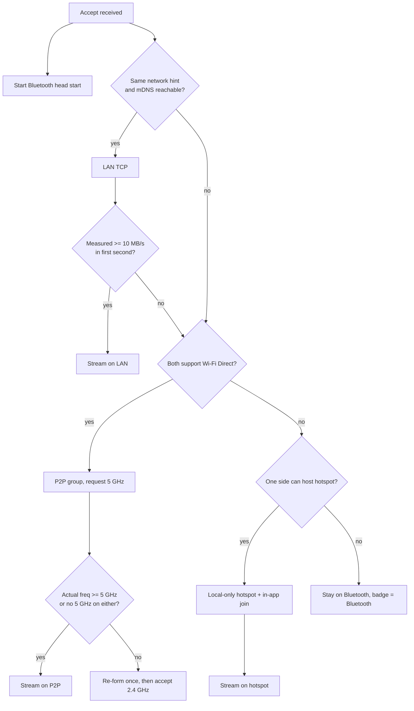
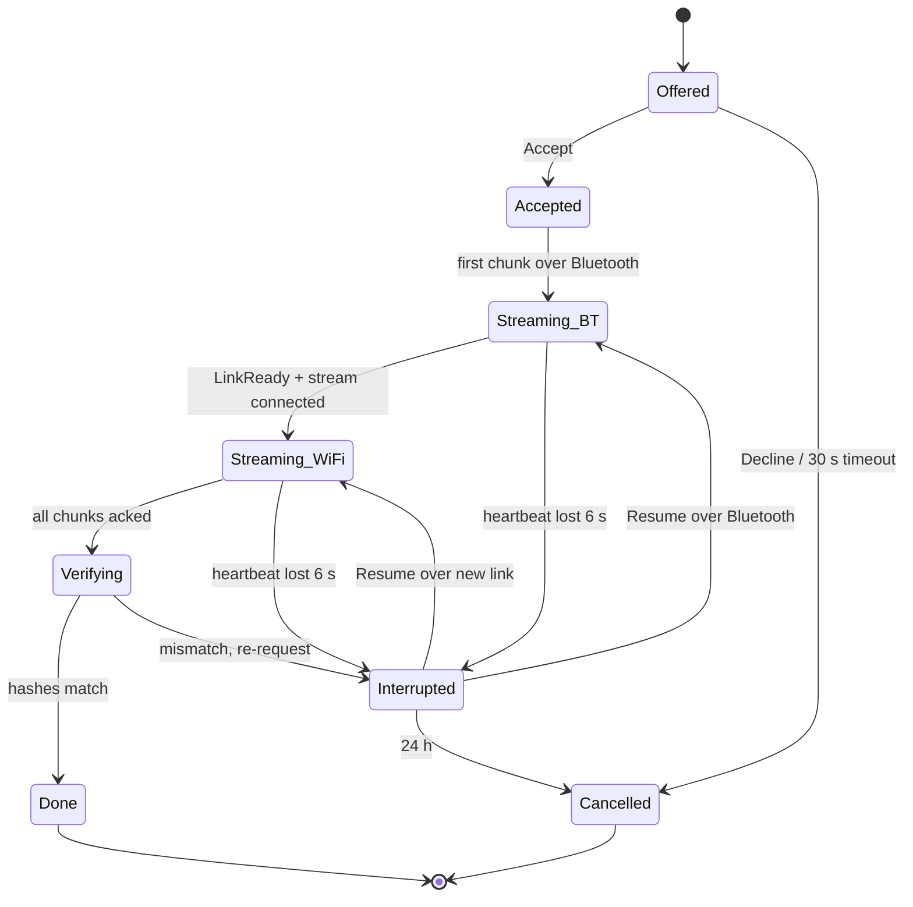

# Architecture and Technical Requirements (TRD)

**Version:** 0.1 draft · **Date:** 23 Sep 2026 · **Targets:** Android 12–17 (API 31+), Windows 10/11, macOS 12+, Ubuntu 22.04+, browser receive page

## 1. Principles

1. **Bluetooth for the first two seconds, Wi‑Fi for the payload.** BLE moves 0.1–0.2 MB/s; a direct 5 GHz Wi‑Fi link moves 20–100 MB/s.
2. **Offline-first.** No server exists in version 1. Discovery, pairing, transfer, history: all on the two devices.
3. **One core, thin shells.** Protocol, crypto, chunking, resume and the database are shared; each platform adds only radios, storage and UI.
4. **Never assume hardware.** Detect capabilities at start, publish them in the beacon, choose the best common path, verify the result (actual channel frequency).
5. **Honest feedback.** The transport badge and hints are first-class outputs of the engine, not UI decoration.

## 2. System context

```mermaid
flowchart LR
  subgraph Phone A
    UA[UI: radar, cards, dashboard] --> SA[Transfer service]
    SA --> CA[Shared core]
    CA --> RA[Radios: BLE, Wi-Fi Direct,<br/>hotspot, LAN, RFCOMM]
  end
  subgraph Device B (phone / desktop / browser)
    UB[UI] --> SB[Transfer service]
    SB --> CB[Shared core]
    CB --> RB[Radios / network]
  end
  RA <-- BLE beacon + handshake --> RB
  RA <== Wi-Fi link: 4-8 encrypted streams ==> RB
```

There is no third box. The browser receive page is served by the phone itself over its hotspot.

## 3. Module layout (Kotlin Multiplatform, assumed; see `handoff.md` for the Rust alternative)

```
repo/
├── core/
│   ├── protocol/      # framing, CBOR messages, transfer state machine
│   ├── crypto/        # identity keys, X25519/HKDF, AEAD, SAS, QR payload signing
│   ├── discovery/     # beacon encode/decode, capability flags, ephemeral ID, mDNS record model
│   ├── transfer/      # chunker, bundler, stream scheduler, ack window, resume manifest, throughput meter
│   ├── ladder/        # transport selection, link lifecycle, restore-previous-network policy
│   └── data/          # SQLDelight schema, repositories (device, transfer, transfer_file, chunk_manifest, settings)
├── platform/
│   ├── android/       # BLE advertise/scan, GATT/RFCOMM, WifiP2pManager, LocalOnlyHotspot, WifiNetworkSpecifier, NsdManager, MediaStore, ForegroundService, thermal
│   ├── desktop-win/   # WinRT BLE, Windows.Devices.WiFiDirect, WLAN join, mDNS (JmDNS), tray
│   ├── desktop-mac/   # CoreBluetooth (JNI/Swift helper), CoreWLAN join, Bonjour, menu bar
│   └── desktop-linux/ # BlueZ D-Bus, NetworkManager D-Bus, Avahi, tray
├── ui/
│   ├── shared/        # Compose: radar, bubbles, drop animation, cards, dashboard tabs (Compose Multiplatform)
│   ├── android/       # Activity, share-sheet intents, direct share, permissions flows
│   └── desktop/       # window, drag-and-drop, tray menus
├── web-receive/       # static HTML/CSS/JS page embedded in the phone app; served by Ktor
├── tools/
│   ├── bench/         # benchmark harness, CSV output, nightly two-phone rig scripts
│   └── fuzz/          # protocol fuzzers
└── docs/              # this pack
```

Dependency direction: `ui → platform → core`. `core` has no Android or JVM-desktop imports; platform modules implement `core` interfaces (`BeaconRadio`, `DataChannel`, `WifiLinkProvider`, `LanDiscovery`, `FileStore`, `PowerPolicy`).

## 4. Transport ladder

> **Changed (WP5):** built in `core/ladder` (`LadderPlanner`, `LinkLifecycle`, `LadderRunner`, `LadderNegotiation`, `P2pCredentials`, `TransportBadge`, `HintRules`) with spec changes S5, N6, N7, N8, N9 and N10 of `docs/implementation-plan.md`. Where the diagram and the rules below differ, this note wins.
>
> - **Rungs.** LAN when the peer's mDNS record is live (N6: the real same-network test), or when both network hints are equal and non-zero and the probe cannot hold up a joiner: it races a Wi-Fi Direct client join, or no direct rung follows. Equal hints collide (192.168.1.1), so they alone never delay a legacy or hotspot joiner, which must wait for the LAN verdict. Different or zero hints without an mDNS record skip the LAN at once (T-15). Then one Wi-Fi Direct rung: only phones host. A phone with Wi-Fi Direct joins as a Wi-Fi Direct client; every other device with Wi-Fi (macOS, Windows, Linux, a browser's computer, a phone without Wi-Fi Direct) joins the phone's group as a legacy WPA2 client (N8, N10), so "both support Wi-Fi Direct" is no longer needed. Then the local-only hotspot, last because its band is system-chosen (N8). Then Bluetooth, which is not set up by the ladder but may carry the whole transfer (never towards a browser or a wired desktop). 5 GHz is requested only when both devices support it, since a 2.4 GHz-only joiner cannot see a 5 GHz group.
> - **Election** of the group owner, first rule that decides: never a device whose station is on 2.4 GHz when the other can host (N9, capability bit 13); 5 GHz hosting (verified bit 4, then 5 GHz-capable, then 2.4 GHz only); Wi-Fi 6 (bit 2); more battery, only when both levels are known; otherwise the receiver. The hotspot is hosted by the agreed group owner when it can host one, and otherwise elected by the same rules from the facts both devices share (capabilities, platform). Whether a device may host right now (tethering, a hotspot in use) and its own radio state are private: they never change who is elected, they only drop a rung, and the exchange below carries that to the peer.
> - **Credentials (S5, N7).** The group owner generates them: network name `DIRECT-xy-Drop-abcd`, passphrase from a 32-symbol alphabet without look-alike characters. Untrusted peer: random per transfer (12-symbol passphrase). Trusted pair: derived with HKDF-SHA256 from the recognition secret (empty salt, info `drop-p2p-ssid-v1` / `drop-p2p-pass-v1`, 16-symbol passphrase), the same on both devices whichever hosts, so Android asks for the network once per pair and the group can be persistent. Sender is owner: in `Offer.link_options`; receiver is owner: in `Accept.link`; owner settled only by the `Accept`: in the owner's `LinkReady`. When the receiver elects the sender but the sender offered no credentials (their facts differ), the receiver hosts if it can. Only offered rungs are kept, and an offered LAN is always kept on both (mDNS visibility is often one-sided). The hotspot host follows the agreed group owner, so it needs no field of its own; a sender that may not host the hotspot it was elected for leaves it out of the `Offer`. A receiver in that position cannot say so when the `Accept` names Wi-Fi Direct, so the sender's hotspot rung then times out while Bluetooth carries the data (a host flag in `LinkIntent` would close this gap). Its system credentials (N15) always travel in `LinkReady`.
> - **One authority (N9).** Both devices run the ladder, but the receiver alone decides which link carries the data: it measures the LAN, accepts a link, cancels the losers, and names the winner to the sender (`LadderSession.sendLinkSelected`, carried by the N13 `ControlMoved`). The sender never accepts or cancels on its own measurement; a link that is up there waits for that message (2 s past its own deadline at most). Everything else (timeouts, failures, re-forms, teardown) follows from what both devices see.
> - **Race (N9).** The LAN probe starts together with Wi-Fi Direct formation when the joiner is a Wi-Fi Direct client, which keeps its network. A legacy or hotspot joiner would leave the LAN being probed, so those rungs wait for the LAN verdict. The first link the receiver accepts wins and the others are cancelled on both devices.
> - **LAN check (F-E4).** 1 s to connect (the first authenticated data stream), then data flows on it while the receiver measures the bytes that arrive for 1 s: 10 MB in the window accepts it, at once when reached early. A slower LAN stays on standby and keeps carrying data (hint `lan_slow`) while the direct rung forms; it is stopped when a joiner must leave the network, and used after all when no direct rung is left, since it still beats Bluetooth.
> - **5 GHz check (§9).** A channel of 4900 MHz or more passes, and so does any channel when either device lacks 5 GHz (the pack's "neither" would force a useless re-form when only one lacks it). Otherwise the group is re-formed exactly once, then 2.4 GHz is accepted with `sta_band24` (the host's station pins the channel), `band24` or `peer_band24_only`. The re-form is decided from the channel both devices hold once the first stream is open (the host's measurement, else the joiner's, exchanged in `LinkReady`), so both re-form together; a channel learnt only later updates the badge and hint, and one that never arrives accepts the link at its deadline with an unknown band. The hotspot is never re-formed.
> - **Fall-through, loss and teardown.** A rung that fails or times out (LAN 1 s, Wi-Fi Direct 6 s per formation, hotspot 6 s including the join) gives way to the next; with none left a LAN that was stopped while it worked gets one more try, then the transfer stays on Bluetooth, with `bt_fallback` only when Wi-Fi is off on one device. When the accepted link is lost, every rung with a spare formation is tried again in plan order (the race loser before the hotspot), and a lost Wi-Fi Direct group is re-formed on 2.4 GHz, which reaches further, and accepted with its hint (T-04). On `Complete` or `Cancel` with nothing queued, or after 60 s without a transfer (a pre-warmed link, or queued transfers that do not start), every link is torn down and the previous network restored; a restore that takes longer than 5 s is logged as overdue. A provider hands each link to the ladder as soon as it exists (`onUp`), so a link whose setup is cancelled at the last moment is still torn down.
> - **Link generations.** `LinkReady.generation` = the run's base + 2 × slot (LAN 0, Wi-Fi Direct 1, hotspot 2) + attempt. Each rung gets two formations per run: attempt 1 is the 5 GHz re-form or the retry after a loss. Both devices number a rung alike even if one skipped another; the next ladder run starts at base + 6.
> - **Browser.** A plan towards a browser (N8) is not run by `LadderRunner`: nobody answers `LinkReady` and a person joins by hand, so the browser receive path (WP9) hosts the rung itself and waits for the first HTTP request with its own timeout.

Input: capability flags of both devices (from beacons), the network hint of both, radio states. Output: an ordered list of `LinkCandidate`s. The engine starts the Bluetooth head start immediately and brings up the first candidate in parallel.



Rules:

- Two phones on mobile data have different (or no) network hints → the LAN branch is skipped in < 1 ms.
- Group owner election: prefer the device that (a) can host 5 GHz, (b) has Wi‑Fi 6+, (c) has more battery; tie → the receiver.
- Any candidate that fails within its timeout (LAN 1 s, P2P 6 s, hotspot 6 s) falls through to the next while the Bluetooth stream keeps the transfer alive.
- The link is torn down and the previous network restored within 5 s of `Complete`/`Cancel`, or after 60 s idle with no queued transfers.

## 5. Discovery

### 5.1 BLE beacon (legacy advertising, 31 bytes total)

> **Changed (WP1):** built in `core/discovery` (`BeaconBody`, `BeaconAdvertisements`, `BeaconAdvertisement`) with spec changes S10, S11, N4, N6 and decision 5 of `docs/implementation-plan.md`. Where the table below differs, this note wins.
>
> - **Body, identical in both carriers (14 bytes, 20 with a Classic address).** Multi-byte fields are big-endian. `0` version `0x01` · `1–6` `eph_id` (§5.3) · `7–8` capabilities as a `u16`, bit *n* of §5.2 = bit *n* (bit 0 is the LSB of byte 8) · `9–12` network hint (N6; zero when not connected) · `13` bits 7–6 visibility (0 Everyone, 1 Everyone for 10 min, 2 Trusted only; 3 Hidden is never sent), bits 5–3 platform (0 phone, 1 laptop, 2 desktop, 3 browser proxy; codes 4–7 are read as an unknown platform shown with a generic glyph, so a platform added later stays visible to older scanners, and are never sent), bits 2–0 reserved (sent as 0, ignored) · `14–19` optional BR/EDR address in display order (S10: desktops that can read their adapter address put it here; phones omit it, and six zero bytes read as absent). This field replaces the "reserved / padding" row of the table.
> - **Versioning.** The first byte of every drop record says what it is: `0x01`–`0x0F` are beacon bodies of this layout, `0x10`–`0x7F` are reserved for incompatible layouts (dropped as unsupported), and `0x80`–`0xFF` are auxiliary records (`0x81` complete and `0x82` shortened nickname; others are ignored). v1 is exactly 14 or 20 bytes. A later minor version (`0x02`–`0x0F`) keeps bytes 0–19 as they are, bytes 14–19 being the optional Classic address (six zero bytes when absent), and may only append fields from offset 20, so it is 14 or at least 20 bytes long. Decoders read bytes 0–19 and ignore the rest, so a v1 phone still reads a newer desktop's Classic address (S10). Decoders raise only `DiscoveryFormatException` for bad input. A body is invalid when bit 11 disagrees with the hint, bit 13 is set without bit 11, the visibility is Hidden, or its length is not one of the above.
> - **Two carriers (S11).** Service data (Android, BlueZ): Flags `02 01 06` ‖ complete 16-bit UUID list `03 03 uu uu` ‖ Service Data `LL 16 uu uu` + body. That is 25 bytes, exactly 31 with the Classic address. Manufacturer data (Windows): Flags ‖ Manufacturer Specific `LL FF cc cc 64 72` + body (company identifier little-endian, then the marker `"dr"`). That is 23 or 29 bytes. macOS does not advertise. Scanners accept both carriers. They ignore unrelated AD structures, other UUIDs and foreign data under the shared test company identifier, and skip zero length bytes (padding). A length byte that runs past the buffer is an error. Every built payload is checked to fit 31 bytes.
> - **Identifiers (decision 5).** Until they are assigned, both are placeholders in `AdvertisingFormat`: 16-bit service UUID `0xDF01` (outside the SIG-allocated ranges; 128-bit form `0000df01-0000-1000-8000-00805f9b34fb` for scan filters) and company identifier `0xFFFF`, the value the SIG reserves for tests. S11 names `0xFFFE`, which is not the test value. Neither placeholder may ship.
> - **Scan response (service-data carrier only).** One Manufacturer Specific AD `LL FF cc cc 64 72 81|82` + nickname in UTF-8, cut at a code point boundary to at most 24 bytes (`0x82` marks a shortened name). It must not be service data under our UUID: BlueZ (`Device1.ServiceData`) and CoreBluetooth (`kCBAdvDataServiceData`) keep one value per UUID, so a nickname record arriving in the scan response would replace the beacon body, and Linux and macOS desktops would lose phones from their radar. Advertising data and scan response therefore never share an AD key (tested by folding both into per-UUID and per-company maps, last one winning). The manufacturer-data carrier sends no scan response, because its body already uses the company key and WinRT cannot set one; those devices are named over mDNS. The old 12-byte limit came from the 128-bit UUID, which is gone (see the plan's "scan response size" item). There is no 128-bit UUID and no Complete Local Name, which Android apps cannot set anyway. Scanners accept a nickname record under either key. Received names are sanitised: control and format characters (bidi controls, zero-width and invisible characters, word joiner, soft hyphen, BOM), blank fillers (Hangul fillers, braille blank) and stray joiners, variation selectors and tag characters are removed, and a name with no visible character counts as none.
> - **Visibility (F‑A5, N4).** Hidden never advertises (building it is an error). Trusted-only sends no scan response, a zero hint with bits 11 and 13 cleared, and no Classic address, because a permanent MAC would link every epoch. Otherwise bit 11 follows the hint. An advertisement is valid until the next epoch boundary; the platform then rebuilds it and restarts the advertising set, so the OS address rotates with the ID.
> - **Network hint (N6) is a weak prior, never evidence.** On IPv4-only networks its input is just the gateway and DHCP server addresses, so every network on the same factory default (`192.168.1.1`, `192.168.0.1`, `10.0.0.1`) and every phone hotspot (`192.168.43.1`, `172.20.10.1`) gives the same hint: collisions are systematic. And two devices on one LAN disagree when one lacks IPv6 or the DHCP server address. WP5 may use it only to order its attempts; mDNS reachability decides whether two devices share a LAN.

| Offset | Size | Field | Notes |
| --- | --- | --- | --- |
| 0 | 3 | Flags AD structure | Standard LE General Discoverable |
| 3 | 4 | 16-bit Service UUID AD structure | App service UUID (assign from a 16-bit range only if registered; otherwise use 128-bit in scan response and service data with a 16-bit alias — verify size budget) |
| 7 | 2 | Service Data AD header | Length + type 0x16 |
| 9 | 2 | Service UUID (16-bit) | Same UUID |
| 11 | 1 | Protocol version | 0x01 |
| 12 | 6 | Ephemeral device ID | See §5.3 |
| 18 | 2 | Capability flags | See §5.2 |
| 20 | 4 | Network hint | Truncated SHA‑256 of current BSSID (or zeros) |
| 24 | 1 | Visibility + platform | 2 bits visibility, 3 bits platform (phone, laptop, desktop, browser-proxy), 3 bits reserved |
| 25 | 6 | Reserved / padding | Keep total ≤ 31 |

Scan response (another 31 bytes): Complete Local Name (nickname, UTF‑8, truncated to 12 bytes) + 128-bit service UUID.
Where Extended Advertising is supported on both sides, the same fields are sent in one extended PDU with the full nickname; legacy stays on for compatibility.

Timing: advertise interval 100 ms foreground / 1000 ms background (`ADVERTISE_MODE_LOW_LATENCY` / `LOW_POWER`); scan `SCAN_MODE_LOW_LATENCY` while the radar is visible, `SCAN_MODE_LOW_POWER` in background with a service-UUID filter.

### 5.2 Capability flags (16 bits)

> **Changed (WP1):** bit 11 means "a network hint is present" (N6). It is set exactly when the 4-byte hint is non-zero, and cleared together with bit 13 in Trusted-only mode or when no hint can be derived; receivers reject a beacon where the two disagree. Equal or different hints say little about sharing a LAN (see the §5.1 note). Bit 13 is `STATION_ON_5GHZ` (N9, defined in WP0): the connected network is on 5 GHz or above, valid only together with bit 11. Bits 14–15 stay reserved: sent as 0 and passed through unchanged when received. On the wire the flags are a big-endian `u16` at beacon offset 7 and four lower-case hex digits in the mDNS `cap` key; both sources carry the same normalised value.

| Bit | Meaning |
| --- | --- |
| 0 | Wi‑Fi 5 GHz supported |
| 1 | Wi‑Fi 6 GHz supported |
| 2 | Wi‑Fi 6 (802.11ax) or newer |
| 3 | Wi‑Fi Direct supported |
| 4 | Can host a 5 GHz P2P group (verified at least once) |
| 5 | Can host a local-only hotspot |
| 6 | Wi‑Fi Aware supported |
| 7 | Bluetooth Classic RFCOMM available |
| 8 | BLE extended advertising supported |
| 9 | BLE LE Coded PHY supported |
| 10 | Default save location is removable (microSD) |
| 11 | Currently connected to a Wi‑Fi network (network hint valid) |
| 12 | Desktop without Bluetooth (mDNS-only record) |
| 13–15 | Reserved |

### 5.3 Ephemeral device ID and trusted resolution

> **Changed (WP1):** with spec changes S3 and N4, built in `core/discovery` (`EphemeralIds`, `EphemeralIdResolver`). Where the bullets below differ, this note wins.
>
> - `epoch = floor(unix_seconds / 900)`; `eph_id = HMAC‑SHA256(k_adv, "drop-eph-v1" ‖ u64be(epoch))[0..6]`. The context prefix is new.
> - S3: `k_adv` (32 bytes) is shared with every trusted peer inside the encrypted session (WP2), so all trusted peers resolve the same rotating ID; `recognition_secret` is used only for the `Hello` proof. S3 rotates `k_adv` on "Forget" and "Reset identity" and re-shares it on next contact (WP2).
> - **Open S3 issue for WP2 and the product owner: rotating on "Forget" cuts off the remaining friends.** After Bob forgets Carol, Alice still holds Bob's old `k_adv`. Bob's new beacons and TXT records resolve to unknown on Alice's device and, in Trusted-only mode, are dropped (last bullet), so Alice never sees Bob to make the contact that would re-share the key, until Bob happens to start a transfer to her. Options: (a) after a Forget, re-share the new `k_adv` with each remaining trusted peer over any authenticated contact and, until each has acknowledged it, alternate advertising between IDs of the old and the new `k_adv` (the forgotten peer can track only during that grace period); (b) rotate only on "Reset identity". WP1 is ready for either: a `TrustedPeer` takes its previous `k_adv` generations as well, so a re-share leaves no gap in recognition, and the radar's `TrustState` input carries this device's own secrets together with the peers, so an own rotation applies to a running radar, and a rotated-out own secret stays recognised for two epochs so echoes of the last advertisement never show up as a stranger.
> - Resolution: for a sighting in epoch *e* the IDs of *e − 1*, *e* and *e + 1* are accepted. The IDs of all trusted peers for an epoch (every secret generation of each), plus our own (so our echo is dropped), are computed once into a hash table. Tables are cached for two epochs around the latest sighting, so resolving a packet takes at most three map lookups and no cryptography (§15 budget, tested with 100 peers). An ID that matches two different peers is treated as unknown, never guessed. The wall clock is used only here, for the epoch; every radar duration (the 5 s expiry, smoothing windows, record ageing, alarms) runs on a monotonic clock, so a clock correction neither keeps departed devices nor drops present ones.
> - A stranger's radar bubble is keyed by the first ID it was seen with. It survives the stranger's rotation when the new ID first appears within 10 s of an epoch boundary and exactly one bubble of the previous epoch shares its Bluetooth address, Classic address or LAN host; failing that (the advertising set restart usually changes the address), exactly the same nickname, platform, capabilities, visibility and hint link it. For 10 s a Bluetooth link is undone, splitting the bubbles, if a second new ID with the old bubble's facts appears (a look-alike, or the real device after a relay rotated first) or the old ID is heard again from the old address; the old ID from any other address is a replay and is ignored. Links live in memory only and use nothing that is not sent in clear anyway; a session that learns the peer's next ID over the encrypted link keeps the bubble explicitly and for good (`NearbyDevices.link`).
> - F‑J1, restated as what the beacon guarantees: without `k_adv`, the IDs of different epochs are unlinkable. The whole advertisement is unlinkable across epochs only in Trusted-only mode, which sends no nickname, hint or Classic address and restarts the advertising set at the boundary (N4). In Everyone mode the nickname, the hint, a desktop's Classic address and the capability and platform bits can still link two scans.
> - Trusted-only: a scanner drops Trusted-only beacons and TXT records that none of its trusted peers resolves (F‑A5).

- `identity_pk` = Ed25519 public key (32 bytes). `device_id` = SHA‑256(identity_pk)[0..16].
- Every 15 minutes: `epoch = floor(unix_time / 900)`; `eph_id = HMAC‑SHA256(k_adv, epoch)[0..6]`, where `k_adv` is a per-device secret rotated when the user taps "Reset identity".
- For a trusted peer, both sides hold `recognition_secret` (derived at pairing via HKDF from the session key with label `"recog"`). The peer's beacon is resolved by computing `HMAC(recognition_secret, epoch)[0..6]` for the current and adjacent epochs and comparing. Untrusted observers see an unlinkable 6-byte value.
- Trusted-only visibility: the device advertises but the `eph_id` uses the recognition scheme only; strangers cannot start a handshake because the GATT/RFCOMM channel requires a proof of `recognition_secret` in the Hello.

### 5.4 mDNS / DNS‑SD record

> **Changed (WP1):** built in `MdnsRecord` with spec change N4. TXT keys, in order: `v=1`, `eph` (12 lower-case hex digits), `cap` (4 lower-case hex digits), `plat` (`phone`, `laptop`, `desktop`, `browser`; any other token `[a-z0-9-]{1,32}` reads as an unknown platform, so a record of a later version stays readable), `nick` (at most 64 UTF-8 bytes; omitted in Trusted-only mode), `port` (decimal 1–65535), and a new `vis` key (visibility code 0, 1 or 2; absent means 0) so the LAN path honours F‑A5 as well. The permanent `id` is no longer published. The instance name is `drop-<eph>` and is registered again at every epoch boundary. Decoding follows RFC 6763 §6: printable-ASCII keys compared case-insensitively, no duplicates, each `key=value` at most 255 bytes, the record at most 1300 bytes, unknown keys ignored; anything else raises `DiscoveryFormatException`. Later `v` values may only add keys. Bluetooth and mDNS sightings of one device merge on the radar when their `eph` values match; for trusted peers they merge when both resolve to the same device, even across epochs. None of this is authenticated (a TXT record can carry anyone's `eph`), so no source replaces another: the radar keeps every live DNS-SD claim (newest first, at most four) and every Bluetooth address heard in the last 5 s as candidates for WP5 to try behind the handshake identity check (F‑B4). A stranger's claims from two different hosts contradict each other, and none of them is offered while both are live. A `nick` replaces the Bluetooth name only when it is the full form of a shortened one; a LAN host cannot relabel a bubble.

Service type `_<appname>._tcp` (decide with the name). TXT keys: `v=1`, `id=<device_id hex>`, `eph=<eph_id hex>`, `cap=<flags hex>`, `plat=<phone|laptop|desktop>`, `nick=<nickname>`, `port=<control port>`. Announced on Android with `NsdManager`, on desktop with JmDNS / Bonjour / Avahi. Used for the LAN path and for computers without Bluetooth.

## 6. Handshake

> **Changed (WP2):** implemented in `core/crypto` (packages `handshake`, `qr`, `trust`) with spec changes N1, N2, N3 and S3 of `docs/implementation-plan.md`. Where §6.2 and §6.3 below differ, this note wins.
>
> - **Three plaintext messages, commit then reveal (N1).** All are deterministic CBOR maps with integer keys (RFC 8949 §4.2.1; decoders accept only the canonical encoding, at most 1024 bytes). `Hello` A→B: `1` version, `2` identity_pk_A, `3` commitment = SHA‑256("drop-commit-v1" ‖ eph_pk_A ‖ nonce_A), `4` caps (16 bits), `5` nickname (≤ 64 UTF‑8 bytes), `6` platform (3 bits), `7` AEAD preference (`1` AES‑256‑GCM, `2` ChaCha20‑Poly1305), `8` trusted proof (optional). `HelloAck` B→A: `1` version, `2` identity_pk_B, `3` eph_pk_B, `4` nonce_B, `5` caps, `6` nickname, `7` platform, `8` AEAD preference, `9` trust ack (optional), `10` sig_B. `HelloReveal` A→B: `1` eph_pk_A, `2` nonce_A, `3` sig_A. Nonces are 16 bytes. `Hello` no longer carries `eph_pk` or a signature.
> - **Transcript signatures (N2).** `th(m₁…mₖ) = SHA‑256("drop-transcript-v1" ‖ Σ u32be(len mᵢ) ‖ mᵢ)` over the exact bytes sent. sig_B = Ed25519("drop-sig-ack-v1" ‖ th(Hello, HelloAck without key 10)); sig_A = Ed25519("drop-sig-reveal-v1" ‖ th(Hello, HelloAck, HelloReveal without key 3)). B checks the commitment, then sig_A; A checks sig_B. Version, caps, nickname and platform are used only after verification. Refused: bad signature, commitment mismatch, all-zero X25519 output, wrong field size or range, version other than 1, an identity key of small order (the 8 torsion points in any encoding, under which anyone can sign; also refused in QR codes and by `ed25519Verify`), the peer using our own identity key, and (reconnects, N3) an identity other than the one the caller expects.
> - **Key schedule.** `ss = X25519(eph)`; `k_session = HKDF‑SHA256(ikm = ss, salt = nonce_A ‖ nonce_B, info = "drop-session-v1" ‖ th(Hello, HelloAck, HelloReveal))`; then `HKDF‑SHA256(ikm = k_session, salt = "", info = label)` for `k_A→B` ("drop-key-a2b-v1"), `k_B→A` ("drop-key-b2a-v1"), the Finished keys ("drop-finished-a-v1", "drop-finished-b-v1") and `recognition_secret` ("drop-recog-v1"). Key confirmation: each side's first encrypted control payload (stream 0, counter 0) is `Finished = HMAC‑SHA256(own finished key, th)`, checked before anything else from the peer is acted on.
> - **SAS (F‑B3).** `u32be(SHA‑256("drop-sas-v1" ‖ identity_pk_A ‖ identity_pk_B ‖ eph_pk_A ‖ eph_pk_B ‖ nonce_A ‖ nonce_B)[0..4]) mod 10⁶`, six digits, zero-padded. A fixes eph_pk_A before it sees eph_pk_B and B fixes eph_pk_B before it sees eph_pk_A, so a man in the middle cannot search within one handshake: security is 10⁻⁶ **per started handshake**. It can still start many. As initiator towards B it knows every SAS input once the `HelloAck` arrives, before it reveals anything, and can drop the connection unseen whenever B's code differs from the one the other victim shows. So attempts must be capped:
>   - **Responder.** One `HandshakeGuard` per device, shared by every responder on every transport, holds a `PairingAttemptLimiter` for handshakes without a valid trusted proof: one in flight at a time (30 s time-out); each one that ends without a verified `HelloReveal` (bad reveal, dropped connection, `abort()`, time-out) or that the UI reports as a rejected code is a failure; after 5 free failures new untrusted handshakes are refused with `RATE_LIMITED` for 1 min, doubling per further failure up to 1 h; one failure is forgiven per quiet hour. An attacker gets 11 guesses in the first hour and about one per hour after that: about 1 % success after a year of continuous probing. Trusted peers bypass the limiter. The protocol layer calls `abort()` when a connection closes mid-handshake.
>   - **Initiator.** The UI shows the SAS as soon as the handshake result exists, on both sides, not only after Finished, and an untrusted handshake is never retried automatically: each retry is a fresh guess the user would not see.
> - **AEAD choice.** AES‑256‑GCM when both preferences say AES, otherwise ChaCha20‑Poly1305 (§7.1). The preferences are signed, so neither can be downgraded.
> - **Trusted proof (S3, §5.3).** With a stored pairing A adds `proof = HMAC‑SHA256(recognition_secret, "drop-proof-v1" ‖ u64be(epoch) ‖ identity_pk_A ‖ commitment)`, where `epoch = floor(unix_time / 900)` on A's clock (not sent). B accepts a proof for its own epoch ± 1, and remembers every `(identity_pk_A, commitment)` it accepted for 45 min (the longest a proof stays acceptable, in the device's `HandshakeGuard`); a repeat counts as no proof. So a sniffed `Hello` cannot be replayed to get past Trusted-only mode, or to collect B's signed `HelloAck` and identity, which would link B across beacon rotations (F‑J1). In Trusted-only mode B refuses a `Hello` without a valid, fresh proof with `TRUST_PROOF_REQUIRED` before sending anything. When B accepts a proof it adds `trust ack = HMAC‑SHA256(recognition_secret, "drop-proof-ack-v1" ‖ u64be(epoch) ‖ identity_pk_B ‖ commitment)` with the epoch the proof verified under, so A learns that B still holds the pairing. The recognition secret is only used for this proof; beacons resolve through the shared `k_adv` (§13 note).
> - **Reconnects (N3).** Every reconnect runs this handshake again (fresh keys, counters from 0) and passes the peer's identity key as the expected identity.
> - **QR payload (§6.3).** Keys `1` v, `2` id, `3` identity_pk, `4` eph_id (6 bytes), `5` link {`1` kind "p2p"|"hotspot"|"lan", `2` ssid, `3` pass, `4` addr, `5` port} (optional), `6` exp (optional), `7` sig. `sig = Ed25519("drop-qr-v1" ‖ encoding of keys 1–6)`; the context prefix is new. A code with `link` must carry `exp`. The scanner refuses a code whose signature fails, whose id ≠ device_id(identity_pk), whose `exp` has passed (T‑12), or whose `exp` lies more than 5 min + 2 min clock allowance ahead. The QR text is base64url without padding.

### 6.1 Channel

> **Changed (WP7ab):** with spec change S10 the Bluetooth channel is chosen three ways, built in `platform/android` (`BluetoothChannelConnector`, `BluetoothChannelListener`, `SocketStreamChannel`, `GattStreamChannel`, `DropBluetoothProfile`). Where the paragraph below differs, this note wins.
>
> - **Three paths.** Android apps cannot learn a phone's Classic address, so phone to phone uses Bluetooth LE. (1) **LE L2CAP** connection-oriented channel, the primary Android↔Android channel: the receiver listens with `listenUsingInsecureL2capChannel` and publishes the PSM in the channel-info characteristic of the drop GATT service; the sender connects GATT to the LE address it scanned (the exact `BluetoothDevice` the scan reported, which carries the random address type), reads the PSM, connects `createInsecureL2capChannel` and releases its GATT client. (2) The **GATT stream** on the connection already open, when L2CAP fails, no PSM is published or the channel info cannot be read or parsed (a failed read, a future or broken value counts as "no PSM"), and the way in for desktops without LE L2CAP (Windows apps have none). (3) **RFCOMM** (`createInsecureRfcommSocketToServiceRecord`) first toward a desktop that publishes its Classic address in the beacon (S10); when it fails, the desktop's LE addresses are tried. The phone's RFCOMM listener exists but is off by default, since nothing can learn a phone's Classic address. Every path is insecure (no pairing dialog, no bonding, no characteristic needs encryption); the §6 handshake authenticates the peer. Each channel reports its `transport`, for the diagnostics log. The listener service keeps the GATT server and the L2CAP server socket open while Bluetooth is on and reopens them after Bluetooth returns (a new PSM is republished). Whatever does not open is retried: a server socket every 2 s, the GATT server with a back-off from 2 s to 30 s, since it can fail right after Bluetooth turns on or before `BLUETOOTH_CONNECT` is granted and without it no peer learns the PSM; the service calls `refresh()` after a permission grant to retry at once.
> - **Profile** (desktops in WP10 and iPhone later must use exactly these). GATT service = the advertised 16-bit service UUID on the Bluetooth base UUID (`0000df01-0000-1000-8000-00805f9b34fb`, the decision 5 placeholder). Characteristics: `b7c90001-7a3e-4f8e-9d41-6c2f0e5a8d13` channel info, read: `u8 version (1) ‖ u8 flags (bit 0: L2CAP listening) ‖ u16 PSM`, later versions may append; `b7c90002-…` client→server, write without response; `b7c90003-…` server→client, notify, with the standard CCCD. RFCOMM service record: the same UUID, name `Drop`.
> - **GATT stream.** Right after connecting, the client asks for high connection priority and the 2M PHY where supported, so service discovery and the channel-info read run at the fast interval (they are round trips of the 400 ms budget); only on the GATT stream path does it then ask for ATT MTU 517 (512-byte values), which an L2CAP channel does not use. The lab compares this order with the MTU exchange first. Each write or notification is one segment `u8 type ‖ u16 seq ‖ body`: `OPEN(u8 version, u16 credits, u16 max segment)` client→server first; `OPEN_ACK` with the lower of the two versions and the server's credits; `DATA` (at least one byte, consumes one credit); `CREDIT(u16 increment)`; `CLOSE` (orderly, both directions); `RESET(u8 reason)` (0 unspecified, 1 protocol, 2 unsupported version, 3 cancelled, 4 timeout, 5 credit overflow, 6 refused). Segment payload = min(both maximums) − 3. Credit flow control per direction (32 segments initially, returned 8 at a time as the reader consumes them) bounds the receive buffer, so no write or notification is ever dropped for lack of room; a peer that exceeds its credits is reset. Per-direction sequence numbers (from 0, wrapping at 2¹⁶) drop duplicates, which appear when the Android stack reports a write-without-response as not sent but sent it and it is retried, and turn a gap into a broken stream. One GATT operation is in flight at a time (Android's rule) and each waits for its callback; a busy stack is retried after 10 ms. The server offers a new stream's channel to its owner before it answers the `OPEN`, and answers `RESET(6, refused)` instead of `OPEN_ACK` when nobody takes the channel or every session is in use, so the client fails at once rather than after its 5 s open timeout. A byte-identical repeat of a session's `OPEN` that arrives before anything else is a retried write: it goes to that session, whose sequence numbers drop it, instead of replacing it.
> - **`DataChannel` semantics** are the same on all three: `read` returns −1 at the end of the stream and after our own close; `write` suspends on the transport's flow control (L2CAP credits, the RFCOMM window, GATT credits) and always ends, with an `IOException` when the stream breaks, even while the GATT stack still holds its segment (a notification never confirmed, a busy-retry pause); `close` is idempotent; one reader and one writer may run at once. The end of the stream differs per transport: an LE L2CAP socket returns −1, an RFCOMM `BluetoothSocket` throws `IOException("bt socket closed, read return: -1")`, which the adapter reads as −1, and neither can tell the peer's orderly close from a lost link, so on both a lost link can also end in −1 (the session's own close and timeouts tell them apart); only the GATT stream distinguishes them (`CLOSE` gives −1, a lost link an `IOException` after the bytes already received). A cancelled socket read or write closes the channel (as `TcpDataChannel` does) and returns only once the blocked call has ended, so it never writes into the caller's buffer afterwards; a cancelled GATT write resets the stream and a cancelled GATT read loses nothing.
> - **Timeouts** (starting points for the lab): GATT connect 8 s, each GATT operation 5 s, `OPEN_ACK` 5 s, L2CAP connect 4 s, RFCOMM connect 8 s; at most three LE addresses per peer. Only the first path tried can meet the 400 ms handshake budget of §15.
> - **Throughput: to verify in the lab.** Expected, not measured: LE L2CAP 100–500 KB/s (2M PHY, data length extension), GATT stream 20–100 KB/s, RFCOMM 100–200 KB/s. The head start's 16 KiB blocks (S1) need at least 16 KB/s for progress within 1 s of Accept (F‑E5).

Android↔Android and Android↔desktop with Bluetooth: **RFCOMM** (`listenUsingInsecureRfcommWithServiceRecord` / `createInsecureRfcommSocketToServiceRecord` with the app UUID) — "insecure" avoids the system pairing dialog; our own crypto secures it. A **GATT** characteristic channel (MTU‑negotiated, ≤ 512 bytes per write) is kept as the alternative for iPhone later and for desktops whose BLE stack cannot do RFCOMM (macOS). On the LAN path the handshake runs over the TCP control connection instead.

### 6.2 Messages

| Message | Fields |
| --- | --- |
| `Hello` | `version`, `identity_pk` (Ed25519), `eph_pk` (X25519), `nonce` (16 B), `caps`, `nickname`, `platform`, `sig` = Ed25519 over (`eph_pk` ‖ `nonce` ‖ peer nonce if known), optional `recognition_proof` |
| `HelloAck` | Same fields from the responder |

Session key: `ss = X25519(eph_sk, peer_eph_pk)`; `k_session = HKDF‑SHA256(ss, salt = nonce_A ‖ nonce_B, info = "session-v1")`. Directional keys `k_A→B`, `k_B→A` derived with labels.

Short authentication string (first pairing only): `SAS = decimal(SHA‑256("sas-v1" ‖ identity_pk_A ‖ identity_pk_B ‖ eph_pk_A ‖ eph_pk_B)[0..4] mod 10^6)`, zero-padded to 6 digits, shown on both screens. The user confirms once; both sides then store the peer as trusted with `recognition_secret = HKDF(k_session, "recog")`.

### 6.3 QR payload

CBOR, base64url in the QR: `{v:1, id, identity_pk, eph_id, link:{kind:"p2p"|"hotspot"|"lan", ssid, pass, addr, port}, exp:<unix>, sig}` where `sig` is Ed25519 over all preceding fields. Expiry 5 minutes for one-time codes; `link` omitted and `exp` absent for static device QRs (desktop). Scanning verifies `sig`, treats the pairing as verified (no SAS), and connects directly to `link` if present.

## 7. Transfer protocol

### 7.1 Framing

> **Changed (WP3):** `length` counts the payload bytes only, not the length field or the type byte, so a frame is `5 + length` bytes. Types: `0x01` Hello, `0x02` HelloAck, `0x03` HelloReveal (plaintext, N1), `0x04` Finished (N2), `0x10` Control, `0x11` Chunk, `0x12` StreamOpen (protected). Decoders reject an unknown type, or a length above the type's limit (4 KiB for handshake frames and StreamOpen, 65 KiB for Control, 4 MiB + 64 KiB for Chunk), before allocating the payload. AEAD associated data = `u32 sealed_length ‖ u8 type ‖ u32 stream_id` (N2); the sealed size may grow with the plaintext (for example one tag per 64 KiB AEAD block of a chunk). Frames are sealed while the writer holds its lock, so each stream's frames reach the wire in nonce-counter order however many coroutines write. Stream ids (S7): 0 control and 1 Bluetooth data, both on the connection the handshake ran on; 2 and up for data connections, never reused in a session. The side that opens a data connection takes the id from its own partition, the handshake initiator even ids and the responder odd ids, so the peers never pick the same id even when the connecting side changes between link generations. Every new data connection starts with a StreamOpen frame: `u32 stream_id` in clear, then the sealed `StreamOpen` message, which must name the same id; before opening anything the listener rejects an id below 2, outside the peer's partition, or already opened in the session. The cipher sits behind `FrameProtector` in `core/protocol`; `core/transfer` adapts `core/crypto` to it.

All streams carry length-prefixed frames: `u32 length` ‖ `u8 type` ‖ payload. Control frames are CBOR maps; data frames are binary. Every frame after the handshake is AEAD-encrypted: AES‑256‑GCM with a 12-byte nonce = `u32 stream_id` ‖ `u64 counter`; ChaCha20‑Poly1305 when the platform reports no AES hardware.

### 7.2 Control messages

> **Changed (WP3):** A control payload is the deterministic CBOR array `[type, body]`: definite lengths, shortest-form heads, keys in canonical order, no tags; `body` maps integer labels to fields. Types: 1 Offer, 2 FileList, 3 Accept, 4 Decline, 5 Ack, 6 Resume, 7 Hint, 8 LinkReady, 9 Heartbeat, 10 FileDone, 11 Complete, 12 Cancel, 13 ControlMoved (N13), 14 TrustShare (S3), 15 StreamOpen (S7), 16 Retransmit. Forward compatibility: labels and codes are never reused; decoders ignore unknown keys and (after authentication) unknown message types, read unknown reason codes as `other`, and keep link kinds and hint codes as strings; a change old peers must not ignore bumps `Offer.version`. A message is at most 64 KiB. `Offer` is a summary (N12): count, total bytes, MIME histogram, up to six names and six previews of at most 4 KiB, `chunk_size`, `bundle_small`, `bundle_count` (S4) and `link_options`, with credentials when the sender will be group owner (S5). The file list follows `Accept` as paged `FileList`s; hashes move to `FileDone` (S2). `Accept` carries a link intent (credentials when the receiver hosts), optional resume state and `stream_count`; `LinkReady` always carries the measured `freq_mhz` and any host credentials not known earlier. `Ack` entries can name a Bluetooth block (S1). `Resume` lists missing unit ranges per `file_index` (0xFFFFFFFF = bundles) with an optional first block offset, plus ranges of wholly missing files; it is sent on every reconnect and is the complete missing set, so the sender replaces its queue with exactly those units. `Retransmit` has the same body but is additive: sent while connected after a hash mismatch, it asks for the listed units again (a bad Bluetooth block from its offset) and the sender drops nothing. Field labels: KDoc in `core/protocol/.../ControlMessages.kt`; exact bytes: `GoldenVectors.kt`.

| Type | Direction | Fields |
| --- | --- | --- |
| `Offer` | S→R | `transfer_id` (16 B), `files[]{index, name, size, mime, sha256}`, `chunk_size` (4 MiB), `bundle_small` (bool), `link_options[]`, `total_bytes` |
| `Accept` | R→S | `transfer_id`, `chosen_link{kind, ssid, pass, addr, port, band_hint}`, `resume_bitmap` (optional, per file), `stream_count` |
| `Decline` | R→S | `transfer_id`, `reason` |
| `Ack` | R→S | `transfer_id`, `chunks[]{file_index, chunk_index}` verified (batched every 50 ms or 8 chunks) |
| `Resume` | R→S | `transfer_id`, `missing[]{file_index, chunk_ranges}` |
| `Hint` | either | `code` (`band24`, `peer_band24_only`, `sdcard`, `thermal`, `bundling`, `bt_fallback`, `lan_slow`), `params` |
| `LinkReady` | either | `kind`, `addr`, `port`, `freq_mhz` (the measured channel) |
| `Heartbeat` | either | `t` (every 2 s on the control stream) |
| `Complete` | S→R then R→S | `transfer_id`, `status`, `bytes`, `duration_ms` |
| `Cancel` | either | `transfer_id`, `reason` |

### 7.3 Data frame (type `Chunk`)

> **Changed (WP3):** The header gains `u32 block_offset` after `chunk_index` (S1): 48 bytes = `transfer_id` 16 ‖ `file_index` 4 ‖ `chunk_index` 4 ‖ `block_offset` 4 ‖ `payload_len` 4 ‖ `hash` 16. A Wi-Fi frame carries a whole unit (`block_offset` 0); a Bluetooth frame may carry one 16 KiB block, and `hash` (XXH3-128, decision 6) always covers that frame's payload. For bundles `chunk_index` is the bundle number and `offset_in_bundle` counts from the start of the data area. Bundle plan (S4): files smaller than `min(1 MiB, chunk_size / 4)` are bundled greedily in file-index order, and a file that would push index plus data past `chunk_size` starts a new bundle; both sides derive the plan from the file list and check it against `Offer.bundle_count`. The whole-file SHA-256 arrives in `FileDone` (S2). Sizes are MiB (S6).

| Field | Size | Notes |
| --- | --- | --- |
| `transfer_id` | 16 B | |
| `file_index` | u32 | `0xFFFFFFFF` = bundle |
| `chunk_index` | u32 | |
| `payload_len` | u32 | ≤ 4 MiB |
| `hash` | 16 B | BLAKE3 (or XXH3‑128) of plaintext payload |
| `payload` | variable | Encrypted with the frame |

Bundle payload: `u32 count` then repeated `{u32 file_index, u32 offset_in_bundle, u32 len}` index, followed by concatenated small-file bytes. A file < 1 MiB is always bundled; a file ≥ 1 MiB is chunked. Whole-file `sha256` from the Offer is verified after the last chunk/bundle for that file lands (hardware SHA on ARMv8/x86).

### 7.4 Streams, scheduling, flow control

> **Changed (WP4):** built in `core/transfer` (`TransferEngine`, `SendSide`, `ReceiveSide`, `StreamCountPolicy`, `ThroughputMeter`, `AckBatcher`, `SecureSession`, `TcpDataChannel`). Stream count: 4, raised to 8 for good once the last four 250 ms samples exceed 40 MB/s, 2 while this device is at thermal `SEVERE` or hotter or the peer's `thermal` hint (repeated every 20 s) was seen in the last 45 s, never above `Accept.stream_count`. The link's joiner opens the streams, each starting with an authenticated `StreamOpen` (S7), the first one for control; the host checks each accepted connection in its own coroutine with a 5 s deadline for its `StreamOpen` (so a silent or garbage connection from anyone on the network neither blocks the link nor counts against it), accepts at most `Accept.stream_count` + 1 streams per link, and answers each stream with an authenticated heartbeat, which the joiner waits for before it uses the stream or names it in `ControlMoved`. Both devices cap their streams at the receiver's `Accept.stream_count`; the sender schedules on at most its own target. Work stealing: one producer reads and hashes units into four plaintext buffers, and every stream takes the next prepared unit when its window of 2 allows. Chunk frames are sealed in 64 KiB AEAD blocks (one tag each, the frame's AAD, consecutive counters). The receiver's write queue is a pool of 5 chunk buffers (16 MiB plus the frame being read); a stream reader waits for a buffer before it reads, so a slow disk throttles the sockets. Durability follows N5: bytes written, the `.part` `fsync`ed by a flusher at most 100 ms apart, then the manifest bit set and stored; a failed `fsync` marks nothing and ends the transfer like a failed write. Acks are batched (8 references or 50 ms) except Bluetooth blocks, which are acked at once. Sockets: 4 MiB buffers, `TCP_NODELAY` on control streams, reads and writes in 256 KiB slices (the JDK stages heap I/O through per-thread direct buffers), and a `TcpSocketFactory` for the Android network binding. The live speed (F-F1) counts bytes as the sockets move them (written by the sender, read by the receiver, in slices of at most 256 KiB) and shows an EWMA (α = 0.3) of the rate over the last 3 s of 250 ms samples: whole 4 MiB acks per raw sample would swing the display by half the rate at 10–30 MB/s. The stream-count rule uses acked (sender) or arrived (receiver) bytes over the last second, so the sender's socket buffers filling up cannot trigger the raise; the ladder's LAN check gets the receiver's arrived Wi-Fi bytes. Intervals and deadlines (watchdog, heartbeat pacing, ack batching, meter samples) run on a monotonic clock, so a wall-clock step changes none of them. The control stream moves to a link's first stream when the ladder selects it: `ControlMoved` goes out on the old route (N13), the route changes only once that write succeeded (else the `ControlMoved` goes out on the fallback route first), and the reader applies messages in route order; a route named before its stream is up is provisional (control on the primary, or 5 s without the stream, makes the stream the peer uses its route), and control buffered for a stream that is not the route is bounded (8192 messages, 1 MiB). When that link dies, both devices fall back to the Bluetooth control stream without an interruption. Heartbeats every 2 s on every connection, each written by its own coroutine, so a Wi-Fi stream stuck in a write cannot hold up the Bluetooth heartbeat; the session watchdog fires after 6 s without a frame on any connection, and a per-link watchdog closes a Wi-Fi connection that heard nothing for 6 s while its reader waited on the network (a group that dropped silently), which loses the link and returns data and control to Bluetooth. Hashing (XXH3 per unit, SHA-256 in the stream, the resume re-hash) runs on `EngineConfig.compute`.

- Data streams: 4 by default; raise to 8 when the 1‑second measured throughput exceeds 40 MB/s; lower to 2 under thermal throttling.
- A shared chunk queue feeds all streams (work stealing). Each stream keeps 2 chunks in flight; the sender does not send a chunk until the previous‑but‑one on that stream is acked (per-stream window of 2).
- Receiver: each stream writes to a bounded write queue (16 MiB) drained by one writer thread per destination file; TCP backpressure slows the sender if storage falls behind.
- Socket options: 4 MiB send/receive buffers, `TCP_NODELAY` on control only; on Android all sockets are created from the `Network` returned by `ConnectivityManager` for the P2P/hotspot link (`network.socketFactory`) or `bindProcessToNetwork` so traffic never drifts to mobile data.
- Throughput meter: bytes acked per 250 ms, EWMA α = 0.3 for display; ETA from remaining bytes ÷ EWMA.

### 7.5 Head start and hop

> **Changed (WP4):** the sender streams on the Bluetooth primary right after `Accept`, bundles first, in 16 KiB blocks (S1) with one block in flight; each block is acked at once with its `block_offset`. The first block goes out before the paged `FileList` (N12), whose pages follow interleaved with the next blocks: the receiver verifies, acks and keeps blocks that arrive before its list is complete (up to 1 MiB, then the ack waits), counts them as progress at once, and places them when the list is complete, so a list of thousands of files no longer delays the first progress (F-E5; only a bundle of more than about 1,360 files, whose index fills the first 16 KiB block, shows its first progress on the second block). Wi-Fi streams and a LAN primary start only once every page is written, so no chunk frame overtakes a page its reader needs. When the ladder moves the data to Wi-Fi (`Transfer.useLink`), the Bluetooth worker finishes its in-flight block and stops; the rest of that unit goes over Wi-Fi as one frame starting at the first unacked block (`block_offset` > 0) and is acked whole. The worker lets go of the unit and queues its rest in one step, and a new Bluetooth worker starts only once the stopping one has finished; a `Resume` or `Retransmit` that names the unit it holds tells it where to continue, which also recovers a block ack lost with a Wi-Fi control route. The phase becomes `Streaming_WiFi` when the sender starts using the link. If the Wi-Fi link is lost, its in-flight units are queued again at priority and data returns to Bluetooth until a new link generation is up. The ladder adapter is `LadderTransferBridge` in `core/ladder`.

After `Accept`, chunk 0 (and bundles first, since they are most visible in the UI) starts over the RFCOMM/GATT stream at whatever it can do. When `LinkReady` arrives and a data stream connects, the Bluetooth stream finishes its in-flight chunk and stops; the queue continues on Wi‑Fi. Acks are per chunk, so no double-send occurs. Badge changes from "Bluetooth" to the Wi‑Fi kind on the first Wi‑Fi ack.

### 7.6 Resume

> **Changed (WP4):** the engine writes through `ResumeStore` (a `UnitManifest` per tracking key: received bitmap, XXH3 per unit, and the synced prefix of a unit received as Bluetooth blocks); the app adapts `core/data` to it, and `core/transfer` does not depend on `core/data`. On every reconnect (a new handshake, N3, requiring the peer's identity) the receiver sends `Resume` with the complete missing set and the sender replaces its queue with it; the receiver sends it again when its control route falls back to Bluetooth, and the sender repeats the `FileList` if the receiver had not confirmed it. After an app kill the receiver answers the same `Offer` with `Accept.resume` from the stored record after checking only that each stored unit's bytes are in its `.part`, which fits the 30 s offer window however large the partials are; it re-hashes the stored units in the background while the rest streams, requests a damaged unit with `Retransmit` (N5), and verifies no file before that pass is done. A record resumes only with the peer identity it was made with (N3); an `Offer` with the same id from anyone else starts over. File states are stored in the order they are decided, so a late `PENDING` never overwrites a `DONE`. While parked the free buffers are given back and the sources closed. A file whose data is complete but whose `FileDone` never arrived gets its last unit requested again, which makes the sender repeat `FileDone`; units of a failed file are acked as released so the sender stops sending them. Partials live at `<partials>/<transfer_id>/<file_index>.part` and are published with an atomic move (a copy across volumes), with ` (n)` suffixes for taken names and a per-drop subfolder `<sender> yyyy-MM-dd HH.mm.ss` above 20 files. Partials and the resume record are deleted when the transfer completes or is cancelled, including the cancel after 24 h parked (S8).

Receiver persists `chunk_manifest{transfer_id, file_index, received_bitmap}` after each verified chunk (write-behind ≤ 100 ms). On any reconnect, R sends `Resume` with missing ranges; S re-queues only those. Partial files live under app-private storage as `<transfer_id>/<file_index>.part`; on completion they are moved (rename where possible) into MediaStore/Downloads. Partials and manifests are deleted 24 h after the transfer's last activity.

### 7.7 State machine

> **Changed (WP3):** `Interrupted` is split into `Reconnecting` (active reconnect attempts for 2 min) and `Parked` (waiting for the peer's beacon until 24 h after the interruption, then `Cancelled` with `timeout` and partials cleared); a beacon seen while parked goes back to `Reconnecting` (S8). `Streaming_WiFi` can follow `Accepted` directly (LAN path). A hash mismatch no longer interrupts: the unit is re-requested with `Retransmit` (from `Verifying`, back to streaming) and the third mismatch on a unit or file fails that file. The transfer ends `Done` (with `Complete.status = partial` if some files failed), or `Failed` when every file failed or the peer broke the protocol. A receiver that resolves its last file while `Reconnecting` or `Parked` stays there and sends `Complete` once `Resume` has been exchanged; if the parked window closes first it ends with that outcome without sending it. Implemented as the pure reducer `TransferStateMachine` in `core/protocol`.



### 7.8 Timeouts and errors

> **Changed (WP3):** The values live in `ProtocolConstants` and `TransferStateMachine` enforces them with timer effects: offer 30 s (the sender sends `Cancel`, the receiver `Decline`, both with `timeout`), heartbeat 6 s, reconnect window 2 min, parked window 24 h counted from the interruption (S8). Mismatch strikes count per unit (per-frame hash) and per file (SHA-256). A whole-file mismatch re-requests the file's units (its bundle for a bundled file); an empty file that mismatches fails at once, since nothing can be sent again. Cancel reasons: `user`, `storage`, `timeout`, `verification`, `protocol`, `source`, `other`. Decline reasons: `user`, `busy`, `timeout`, `storage`, `incompatible`, `blocked`, `other`.

| Event | Timeout | Action |
| --- | --- | --- |
| Offer unanswered | 30 s | Cancel; sender sees "No answer" |
| LAN candidate | 1 s to connect, 1 s to measure | Fall through |
| P2P group formation | 6 s | Fall through to hotspot |
| Hotspot start + join | 6 s | Fall through to Bluetooth-only |
| Heartbeat lost | 6 s | Interrupted; keep manifest; attempt reconnect for 2 min, then wait for the peer's beacon |
| Chunk hash mismatch | immediate | Discard, request again; 3 mismatches on one chunk → fail the file |
| Disk full on receiver | immediate | Cancel with `reason=storage`; clear partials |
| Thermal `SEVERE` or higher | — | Streams → 2; Hint `thermal` |

## 8. Link setup by path (platform APIs)

> **Changed (WP7ab):** the Android column's discovery and handshake rows, and capability detection, are built in `platform/android`. Where the table differs, this note wins.
>
> - **Discovery (BLE)** (`AndroidBeaconRadio`). Advertising through `BluetoothLeAdvertiser.startAdvertisingSet`: a legacy connectable, scannable set always (100 ms foreground, 1 s background; one TX power, −7 dBm, in both modes, so peers' radar rings do not jump when this device changes mode), plus an extended connectable set carrying the full 64-byte nickname where `isLeExtendedAdvertisingSupported()` (2M secondary PHY where supported). Every change of advertisement stops the sets and starts new ones, and `AndroidDiscoveryController` rebuilds the advertisement at each epoch boundary, so the radio address rotates with the ephemeral ID (N4); each set also ends by its own duration at that boundary, while the processor sleeps too (§10.1 note). The scan-response nickname stays manufacturer data (core/discovery already keeps it off the service UUID, which settles the dictionary-merging question carried forward from WP1–WP3); `AdvertisingConfig.scanResponse` switches the scan response off for the lab. Scanning: one shared `BluetoothLeScanner` scan with two filters (the service UUID; the company identifier followed by `"dr"`, S11), low latency while the radar is visible and low power otherwise, extended advertisements and every PHY where supported. `ScanScheduler` keeps to Android's five starts per 30 s (conflating mode changes meanwhile) and restarts the scan every 25 minutes, before Android turns a 30-minute scan opportunistic. Starts are kept for the radar: a downgrade from foreground to background waits 15 s (the foreground scan serves the background collector meanwhile, and a radar reopened within that time costs no start) and never takes the window's last start, so opening the radar always scans in the foreground at once (F‑A2). Results are parsed off the callback thread; timestamps convert from elapsed realtime. Radio errors and missing permissions are state (`BeaconRadioState`), never exceptions, and advertising and scanning resume by themselves when Bluetooth comes back.
> - **Handshake channel.** LE L2CAP first, the GATT stream as fallback, RFCOMM toward desktops that publish a Classic address (§6.1 note). This replaces "RFCOMM insecure socket (fallback GATT)".
> - **Capabilities (F‑A4)** (`AndroidCapabilityDetector`, pure mapping in `CapabilityMapping`, table in its KDoc). Bit 5 (local-only hotspot) is set whenever the device has Wi-Fi; whether a hotspot can run while connected (`isStaApConcurrencySupported`) is reported separately for WP7d. Bit 4 needs a 5 GHz group verified once, which WP7c reports through `setVerifiedP2p5GhzHost`. Bits 11 and 13 come from the connected Wi-Fi network with internet capability (a local-only network never counts): its frequency from the network's `WifiInfo` transport info, its hint inputs from `LinkProperties` (default-route gateways, `getDhcpServerAddress()`, IPv6 addresses), none of which needs location permission (N6, N9). Extended advertising and Coded PHY support are read while Bluetooth is on and remembered, since some builds answer false while it is off. Updated on connectivity callbacks and Bluetooth and Wi-Fi state broadcasts, which only signal one background worker: detections never overlap (one that read the networks before an `onLost` cannot publish after the one that followed), the main and connectivity threads never wait for the Wi-Fi service's binder calls, and the hardware answers are re-read only after a Wi-Fi or Bluetooth state change or `setSaveVolume`, not on every network callback.

> **Changed (WP7cd):** the Android column's Wi-Fi Direct, hotspot, hotspot join, LAN discovery and restore rows are built in `platform/android` (packages `wifi` and `lan`) with spec changes N6, N7, N8, N9 and N15. Where the table differs, this note wins.
>
> - **Wi-Fi Direct** (`AndroidP2pLinkProvider` over the `P2pRadio` seam; `AndroidP2pRadio` on `WifiP2pManager`). Permissions are checked first (`NEARBY_WIFI_DEVICES` with `neverForLocation` on 13+, `ACCESS_FINE_LOCATION` on 12), and every failure is a typed `WifiLinkException`, never a platform exception. Hosting removes a group this app left behind (its `DIRECT-xy-Drop-abcd` name form; another app's group makes the rung fail busy), then runs `createGroup` with the ladder's credentials, `GROUP_OWNER_BAND_5GHZ` when both devices support 5 GHz and `GROUP_OWNER_BAND_2GHZ` otherwise (a 2.4 GHz-only joiner must see the group; the T‑04 re-form after a loss asks for 2.4 GHz on purpose), persistent for trusted pairs. Formation is awaited on the connection broadcast and confirmed with `requestConnectionInfo` and `requestGroupInfo`, which are polled when broadcasts come late. `getFrequency()` is the link's frequency, and a 5 GHz group records capability bit 4 once (`FiveGhzHostRecorder` → `setVerifiedP2p5GhzHost`, kept in a `VerifiedHostStore`). The §9 re-form is a fresh `createGroup` after the ladder removed the first group, asking for 5 GHz again. A client (`P2P`) calls `connect(config)` with the owner's credentials and `GROUP_OWNER_BAND_AUTO`, since it cannot know where the group came up, and tries again while the owner is not up (a busy framework, no group within 4 s) until the ladder's deadline. A phone without Wi-Fi Direct joins a group (`P2P_LEGACY`) with its SSID and WPA2 passphrase by `WifiNetworkSpecifier`. Cancelled or failed before `onUp`, a started connect is cancelled and a group that may have formed is removed before the cancellation completes; teardown removes the group and waits until it is gone. A group that disappears or changes channel while it is up is reported to `WifiLinkListener.onLinkLost` and `onFrequencyChanged`, for `LadderRunner.onLinkLost` and `onFrequency`.
> - **Sockets** (`SocketActiveLink`, `NetworkBoundSocketFactory`, `LinkDialPolicy`). Every socket of every link gets the §7.4 4 MiB buffers before it connects and never `TCP_NODELAY` (the engine sets it on control connections). Sockets are bound to the link's `Network` (`Network.bindSocket`) on a joined network and the LAN, and to the interface address on a Wi-Fi Direct group and a hosted hotspot, which apps cannot bind to as a `Network`: once the interface is gone the bind fails, so nothing leaves over mobile data (T‑15). Listeners bind the link's interface address, never the wildcard. A `LinkReady` address is dialled only when it is an IP literal on the link's own prefixes, or exactly the group owner for a Wi-Fi Direct client (§13).
> - **Local-only hotspot** (`AndroidHotspotLinkProvider`, `AndroidHotspotRadio`). `startLocalOnlyHotspot` runs after the permission check (Android 12 also needs location services on: `LOCATION_OFF`). SSID (the raw bytes on 33+), passphrase and security come from the `SoftApConfiguration`; the band only on API 36+ (`getChannels`), so the host usually does not know the frequency and the joiner measures it. The real credentials are the link's, which the ladder announces in `LinkReady` (N15), and `hosted`, for the "computer without the app" hint. Android does not name the hotspot's interface: it is the one that gained a private IPv4 address and belongs to no network `ConnectivityManager` knows. Start failures are typed (`ERROR_INCOMPATIBLE_MODE`, tethering on, is `INCOMPATIBLE_MODE`; `NO_CHANNEL`; `DISALLOWED`), and a start that was given up closes a reservation that arrives later. Without STA/AP concurrency a phone on Wi-Fi loses its station while it hosts; that is allowed by default (refusable), and teardown waits for the station.
> - **Specifier join** (`SpecifierJoiner`, `AndroidNetworkRequester`). A local-only `WifiNetworkSpecifier` request (SSID, WPA2 or WPA3 passphrase, BSSID when known) with a `NetworkCallback`. The link is up once the network is available with an address, and every socket is bound to that `Network`. Typed outcomes (N7): `BACKGROUND` without filing anything when the app is neither in the foreground nor running a foreground service; `onJoinApprovalNeeded(ssid)` before the first join of an SSID this device has not joined, because Android then shows its dialog (a trusted pair's stable SSID makes it one-time); `JOIN_UNAVAILABLE` for `onUnavailable` (no match, or the user declined). One join at a time. Joins ask for WPA2, which also joins the WPA3 transition mode Android's hotspot uses on 2.4 and 5 GHz; the host reports an SAE-only hotspot (`HotspotSecurity.WPA3_SAE`, some 6 GHz builds), but `LinkReady` cannot say so.
> - **Restore (F‑E11, T‑14).** Teardown releases the request, closes the reservation or removes the group. When the link had displaced the station (connected before, gone at release: a joiner without station and local-only concurrency, a host without STA/AP concurrency) it waits for the station to come back (`StationMonitor`, at most 10 s), so the ladder's restore timer measures the real time against the 5 s budget. Each teardown reports a `RestoreReport` to `WifiLinkListener.onRestore`.
> - **LAN and NSD** (`AndroidLanLinkProvider`, `NsdLanDiscovery` on `AndroidNsdApi`). The sender listens on the private IPv4 address of its Wi-Fi network with internet capability (else Ethernet); the joiner takes the network whose prefix holds the host's address; sockets are bound to that `Network`. `NsdLanDiscovery` implements `LanDiscovery`: registrations are awaited (typed `LanDiscoveryException`) and one record is live; found instances are watched with `registerServiceInfoCallback` from Tiramisu SDK extension 7 (Android 14+) and resolved one at a time before; IPv4 addresses come first; a failed discovery is restarted with back-off. `NsdManager` calls are gated by SDK extension versions, as its documentation asks, not by API level.
> - **Permissions (§11).** Android 17 needs `ACCESS_LOCAL_NETWORK` for LAN sockets and `NsdManager` in apps targeting API 37, and without it `NsdManager` would show a service picker: the LAN rung and NSD check it first, and discovery passes `FLAG_NO_PICKER`. The manifest adds `CHANGE_WIFI_STATE`, `CHANGE_NETWORK_STATE`, `INTERNET`, `CHANGE_WIFI_MULTICAST_STATE`, `NEARBY_WIFI_DEVICES` (`neverForLocation`), `ACCESS_FINE_LOCATION` and `ACCESS_COARSE_LOCATION` up to API 32, `ACCESS_LOCAL_NETWORK`, and the optional `android.hardware.wifi.direct` feature.
> - **Multicast and facts.** `MulticastLockHolder` keeps one `MulticastLock` on while any user holds it (the browser page's `drop.local` responder; `NsdManager` before extension 7). `AndroidLinkFacts` builds this phone's `LinkFacts` from the capabilities it published in the handshake (the station band from bits 11 and 13, as the peer reads them), the network hint, the battery and a `HostingState`. STA/AP concurrency is not a `LinkFacts` input, because `hostingAllowed` would drop the Wi-Fi Direct rung too; `hotspotHosting` reports it.

| Path | Android | Windows | macOS | Linux |
| --- | --- | --- | --- | --- |
| Discovery (BLE) | `BluetoothLeAdvertiser`, `BluetoothLeScanner` | `BluetoothLEAdvertisementPublisher` / `Watcher` (WinRT; publisher payload limits — verify) | `CBPeripheralManager` (service UUID + name only), `CBCentralManager` | BlueZ `LEAdvertisement1`, `org.bluez.Adapter1` |
| Handshake channel | RFCOMM insecure socket (fallback GATT) | RFCOMM via `RfcommServiceProvider` / `StreamSocket` | GATT (no RFCOMM for apps) | RFCOMM via BlueZ profile |
| LAN discovery | `NsdManager` | JmDNS | Bonjour (`NetService`) or JmDNS | Avahi or JmDNS |
| Wi‑Fi Direct | `WifiP2pManager.createGroup(config)` with `WifiP2pConfig.Builder().setNetworkName("DIRECT-xx-…").setPassphrase(…).setGroupOperatingBand(GROUP_OWNER_BAND_5GHZ).enablePersistentMode(true)`; joiner `connect(config)`; verify `WifiP2pGroup.getFrequency()` | `Windows.Devices.WiFiDirect` (connect as client to phone's group) — verify band behaviour | Not available | Not used |
| Hotspot host | `WifiManager.startLocalOnlyHotspot(callback)`; read `reservation.softApConfiguration` for SSID/password/band (band not selectable by third-party apps — verify actual frequency) | Mobile hotspot API is system-only; phone hosts | Phone hosts | Phone hosts |
| Hotspot join | `WifiNetworkSpecifier` + `ConnectivityManager.requestNetwork` → use the returned `Network` for sockets | `WiFiAdapter.ConnectAsync(ssid, password)` or `netsh wlan` | `CWInterface.associate(to:password:)` (Location permission required to scan) | NetworkManager D-Bus (`AddAndActivateConnection`) or `nmcli` |
| Restore previous Wi‑Fi | Release the `NetworkRequest`; remove P2P group; system reconnects | Reconnect saved profile | `associate` back to previous SSID | Activate previous connection |

Notes:

- Android 12 requires `ACCESS_FINE_LOCATION` for Wi‑Fi Direct discovery; Android 13+ uses `NEARBY_WIFI_DEVICES` with `neverForLocation`.
- Android 14+ requires `foregroundServiceType="dataSync"` and `FOREGROUND_SERVICE_DATA_SYNC`; Android 15 limits dataSync services to about 6 hours per day — transfers never approach this, but log it.
- The P2P network name must start with `DIRECT-` followed by two characters; passphrase 8–63 characters; generate randomly per transfer unless persistent mode is used for trusted pairs.

## 9. Speed engineering rules (where they live in code)

> **Changed (WP4):** "Big pipes": 4 MiB chunks sealed in 64 KiB AEAD blocks into a small pool of sealed buffers shared by the session's connections, and heap buffers with 256 KiB socket and file slices instead of direct `ByteBuffer`s and `transferTo` (the AEAD needs the plaintext on the heap). Measured: both engines of a 256 MiB loopback transfer in one JVM add about 75 MB of live heap (`jvmMemoryTest`; 2 GB with `-Pdrop.nightly=true`), under the 120 MB budget, and loopback throughput stays above the 20 MB/s floor (about 100 MB/s in the build container). "Pack small files" is the S4 bundler (files below `min(1 MiB, chunk_size / 4)`), with the `bundling` hint from 10 bundled files. "Storage awareness": an `Offer` that does not fit is declined with `storage` before `Accept`, a full disk mid-transfer cancels with `storage`, and a removable destination sends the `sdcard` hint. "Stay awake and cool": `PowerPolicy` supplies the thermal level for the stream count and the `thermal` hint. "Instant start": the first Bluetooth block moves progress within 1 s of `Accept` at 20 KB/s (F-E5), before the file list, also for a list of a thousand files. The sender closes each source once its file is acknowledged and its `FileDone` is out (a retransmit reopens it), so a 5,000-file send does not hold 5,000 descriptors.

> **Changed (WP5):** "Request 5 GHz, verify, re-form once" is `LinkLifecycle` in `core/ladder` (see the §4 note): 5 GHz is requested only when both devices support it, the re-form is decided from the channel both devices exchanged in `LinkReady` so that they re-form together, a group lost at the edge of range is re-formed once on 2.4 GHz (T-04), and the hotspot is never re-formed. "One radio, one job" changes with N9: apps cannot leave infrastructure Wi-Fi, so phones stay on it and the election avoids a host whose station is on 2.4 GHz; only legacy joiners (desktops, browsers) leave their network, and teardown gives it back (F-E11). Per N13, BLE advertising continues at the background interval during a transfer and only scanning pauses; that is the platform radio session's job, not the ladder's. "Instant start": persistent groups come from the stable per-pair credentials (`HostRequest.persistent`), pre-warm from `LadderConfig.prewarm` with the 60 s idle teardown.

| Rule | Module | Implementation note |
| --- | --- | --- |
| Request 5 GHz, verify, re-form once | `core/ladder`, `platform/android` | Read actual frequency; treat 2.4 GHz with both-capable as failure once |
| One radio, one job | `core/ladder` | Leave infrastructure Wi‑Fi during P2P/hotspot; stop BLE scan/advertise after handshake; resume after `Complete` |
| Big pipes | `core/transfer` | 4 MiB chunks, direct `ByteBuffer`s, `FileChannel.transferTo` where the AEAD allows (encrypt in 64 KiB blocks to keep memory flat) |
| Pack small files | `core/transfer` | Bundler threshold 1 MiB; gallery registration batched |
| Storage awareness | `platform/*` | Detect removable target; Hint `sdcard`; write queue 16 MiB |
| Stay awake and cool | `platform/android` | Foreground service, partial wake lock, `PowerManager` thermal listener |
| Instant start | `core/ladder`, `core/transfer` | Head start over BT; pre-warm on file pick; persistent groups for trusted peers |

## 10. Platform layer details

### 10.1 Android

> **Changed (WP8):** the UI side is built in `ui/android` (`MainActivity`, `AppGraph` and the ports next to them) over the shared UI's `DropAppController`. Where the bullets below or the §11 table differ, this note wins.
>
> - **Process model.** One controller per process, created by the `Application`, so UI state survives configuration changes and every activity shows the same state (a share opens an activity in the sending app's task). Until WP7's `TransferService` is connected, the engine ports are the in-memory backend and the radar shows "No devices yet"; permissions, radio state, the gallery, system screens, onboarding and direct share are real.
> - **Share sheet.** `MainActivity` (`singleTop`) takes `ACTION_SEND` and `ACTION_SEND_MULTIPLE` for `*/*`. Only `content:` URIs are accepted (a `file:` URI would be read with this app's rights); names and sizes come from `OpenableColumns`, duplicates count once, and a malformed Intent is ignored rather than crashing. Direct-share targets are dynamic, long-lived sharing shortcuts matched through a `share-target` in `res/xml/shortcuts.xml`, published from the radar's trusted, named devices (closest ring first, at most 8) half a second after the list changes, and removed from the share sheet's cache when a device leaves. Because a direct share sends without another tap once the device is on the radar and the activity is exported, shortcut ids are random 128-bit tokens kept in app-private preferences, never derived from the device key: an id this app did not hand out is only a plain share. Read grants on shared URIs belong to the receiving activity, so a send that outlives it must hand the URIs to WP7's `TransferService` as `ClipData` with `FLAG_GRANT_READ_URI_PERMISSION`; until then an attachment is dropped when its activity is destroyed for good.
> - **Storage (read).** The picker's grid queries `MediaStore` for the 120 most recently added photos and videos, only while the picker is open and media access is granted (thumbnails load page by page and are released when the sheet closes); older media and every other file come through the Files tab, the system document picker (`OpenMultipleDocuments`), which needs no permission.
> - **Permissions (§11).** Asked just in time through the shared `PermissionGate`. On Android 12 `ACCESS_FINE_LOCATION` is requested together with `ACCESS_COARSE_LOCATION` (API 31 ignores a fine-only request); choosing "approximate" still counts as denied. Media asks for `READ_MEDIA_IMAGES` and `READ_MEDIA_VIDEO` (plus `READ_MEDIA_VISUAL_USER_SELECTED` on 14+, where "Select photos" counts as granted), not `READ_MEDIA_AUDIO`: the grid shows photos and videos, and audio comes through the document picker. "Don't ask again" is recognised as blocked (recovery through the app's settings page) once the user has actively denied a permission and the system stops asking for a rationale; a dialog dismissed with Back is not a denial. The app manifest declares only the permissions the UI asks for; the service's install-time permissions come with it.
> - **Battery.** The brand step tries the known OEM screens for the brand (component names are not public API; the lab confirms them per device, T‑22), then `ACTION_REQUEST_IGNORE_BATTERY_OPTIMIZATIONS`, then the app's settings page.
> - **Radios off.** `ACTION_REQUEST_ENABLE` needs `BLUETOOTH_CONNECT`; without it the Bluetooth settings page opens instead. The Wi‑Fi panel falls back to the Wi‑Fi settings page where a build has no panel.
> - **Backup.** Nothing is backed up or moved in device-to-device transfer (`data_extraction_rules.xml` excludes every domain): identity keys and pairings belong to one device.

> **Changed (WP7ab):** identity, crypto and the discovery wiring are built in `platform/android` (spec change N11, decision 7). Where the bullets below differ, this note wins.
>
> - **Secrets at rest (N11).** `AndroidSecretStorage` keeps each secret in its own file under `noBackupFilesDir/secrets`, named by the SHA-256 of the entry name: `"DRSS" ‖ 0x01 ‖ u8 IV length ‖ IV ‖ ciphertext ‖ tag`, with associated data `"drop-secret-v1" ‖ 0x00 ‖ name`, so a file moved to another name does not open. Writes go to a temporary file, are `fsync`ed and renamed atomically. The cipher is `KeystoreSecretCipher`: a non-exportable AES-256-GCM Android Keystore key, no user authentication (the service reads the identity while the screen is locked), in StrongBox when the device has one and in the TEE when StrongBox is missing or refuses the key. The identity seed, `k_adv` and the database key all go through it (`AndroidSecrets.identityStore` / `advertisingSecretStore`). A Keystore reset leaves the files unreadable, which is reported as a corrupted entry (the app offers "Reset identity"); it is never silently replaced.
> - **Crypto (decision 7).** `AndroidCryptoProvider`: platform JCA (Conscrypt) for SHA-256, HMAC, AES-256-GCM, ChaCha20-Poly1305 and `SecureRandom`, HKDF on HMAC. X25519 and Ed25519 come from the platform only when it has them under a known name and reproduces the RFC 7748 and RFC 8032 vectors at first use, since Conscrypt's support depends on its Play-updated module version on Android 12; otherwise BouncyCastle's lightweight, constant-time `rfc7748`/`rfc8032` code (`bcprov-jdk18on` 1.86, lightweight API only, no JCA provider registered). An Ed25519 public key is derived from its seed with BouncyCastle on both paths, since JCA has no such operation. APK cost (§15, 25 MB), measured with R8 9.2 (the SDK's `d8.jar`) over this module's `crypto` package, its public API kept and the consumer rules applied: BouncyCastle keeps about 52 KB of dex, plus 96 KB of `org/bouncycastle/x509/*.properties` that AGP packages as Java resources unless the app excludes them (`packaging.resources.excludes`); unshrunk, the whole jar is 5.5 MB of dex (d8). So the release build type must enable R8. No module does yet: the current unminified release APK of `ui/android` is 33 MB, over budget with or without BouncyCastle, and turning on R8 there, with a CI check of the APK size and the crypto instrumented test run against the minified build (which would catch a missing keep rule), belongs to the release setup of the app (WP7e), not to this library. `hasAesHardware` reads the `aes` feature from `/proc/cpuinfo` and runs a short AES-GCM against ChaCha20-Poly1305 benchmark only when that is inconclusive. The backends in use are exposed for the lab's per-device table.
> - **Discovery wiring.** `AndroidDiscoveryController` owns the `BeaconRadio`, runs `NearbyDevices` on `SystemClock.elapsedRealtime()` (the scan timestamps' base) and exposes the hooks the service and the UI flip: `setRadarVisible`, `setForegroundService`, `setTransferActive` (N13: advertising at 1 s, scanning paused) and `refreshAdvertisement` (after a `k_adv` rotation). `DiscoveryPolicy` maps them to modes: radar visible → 100 ms and low latency; service only → 1 s and low power; neither → off and the radar empties; Hidden never advertises. The epoch timer is a coroutine delay, which stops in deep sleep (it also re-reads the wall clock every 30 s of awake time, for clock corrections), so the boundary does not rely on it: `AndroidBeaconRadio` starts every advertising set with a duration that ends it at the advertisement's `validUntilMillis` (at most 655 s, the controller's limit; a set that ends earlier is restarted for the rest of its epoch), so the controller or the Bluetooth stack's own wake-up timer takes the old ID off the air at the boundary while the application processor sleeps, and an advertisement whose epoch is over is never put on air again (`AdvertisingStatus.Expired`). The device is then invisible until its next wake-up puts the new epoch's ID on air: the timer itself, a scan result that arrives after the boundary, or `wakeUp()`, which WP7e's service calls from an inexact wake-up alarm armed at `advertisement.validUntilMillis` (`setAndAllowWhileIdle`, no exact-alarm permission). To check in the lab: that the stack reports a set's end (`onAdvertisingEnabled(false)`), on which a set capped at 655 s is restarted at once (a timer restarts it too, but only while the processor is awake), and that a set resumed after an incoming connection keeps its duration (some stacks re-enable it without one; the epoch timer still replaces it at the boundary while awake). Sets are tracked from before the stack answers their start, so a start cancelled by a plan change, a failure or a time-out never leaves a set on air.
> - **Radios off.** `RadioEnableIntents`: the enable-Bluetooth dialog when `BLUETOOTH_CONNECT` is granted, else the Bluetooth settings page; the Wi-Fi panel, else the Wi-Fi settings page.

- **Process model:** one `TransferService` (foreground, `dataSync`) owns radios and the engine; the UI binds to it and observes `StateFlow`s. The service starts on the first Offer/Accept and stops 60 s after the last transfer.
- **Share sheet:** `ACTION_SEND`, `ACTION_SEND_MULTIPLE` for `*/*`; direct share via `ShortcutManagerCompat` dynamic shortcuts for trusted nearby devices (refreshed from the radar).
- **Storage:** read via SAF/`MediaStore` URIs (no broad storage permission); write media with `MediaStore` `IS_PENDING` then publish; documents to `Downloads` via `MediaStore.Downloads`; partials in `getFilesDir()/partials`.
- **Battery:** onboarding step opens brand-specific screens (Xiaomi Autostart, Vivo/Oppo background, Samsung sleeping apps) and `ACTION_REQUEST_IGNORE_BATTERY_OPTIMIZATIONS`.
- **Thermal:** `PowerManager.addThermalStatusListener`; `THERMAL_STATUS_SEVERE`+ → streams 2 and hint.
- **Radios off:** `BluetoothAdapter.ACTION_REQUEST_ENABLE`; `Settings.Panel.ACTION_WIFI` panel (apps cannot toggle Wi‑Fi on Android 10+).

### 10.2 Desktop (Compose Multiplatform + JVM)

> **Changed (WP10a):** the shared desktop shell and the LAN path are built in `platform/desktop-common` (its composition root is `DesktopNode`) and `ui/desktop`. Where the bullets below differ, this note wins.
>
> - **Modules.** `platform/desktop-common` is plain JVM with no UI toolkit: JmDNS `LanDiscovery` on one interface picked by `LanInterfaces` (the default-route interface first, then private before public before link-local; VPN, container and other virtual interfaces skipped by name and, since Windows names every adapter `ethN` / `wlanN`, by display name), the LAN `WifiLinkProvider`, the app directories per OS (XDG on Linux, `%APPDATA%` / `%LOCALAPPDATA%` on Windows, `~/Library/Application Support` on macOS; Received folder `~/Received/<App>/`; the secrets, the database and the instance lock sit in the local data folder, so device-bound keys never roam with a Windows profile or a synced config folder), `FileSecretStorage` (owner-only files, atomic writes, a `SecretWrap` seam for the OS keychain), `DesktopPowerPolicy` (thermal level none, a reference-counted keep-awake hook), the `DownloadMarker` seam for Mark-of-the-Web and quarantine, the `core/data` database over the SQLite JDBC driver, the `ResumeStore` adapter (`DataResumeStore`) and the 24 h `PartialsSweeper`. The per-OS modules only contribute `DesktopPlatformServices`: `desktop-linux` adds the XDG autostart entry for now; keychains, radios, keep-awake and download marking follow in WP10b–d.
> - **No-Bluetooth path.** Until the desktop radios exist every desktop is LAN-only: it announces `DESKTOP_WITHOUT_BLUETOOTH`, the ladder plans the LAN rung only, the radar shows the §9 banner with the static QR (F‑B6, re-made each beacon epoch since it carries the beacon ID), and the browser receive page (F‑H4) is served on the LAN address. On a LAN the IP URL is the only address: a shared network may already have a `drop.local`, so the desktop claims no mDNS name. "Show my code" is a five-minute code (`QrPayloadCodec.createOneTime`) with a LAN link to this computer's address and control port, and that address as the typed fallback, so a phone on a network that filters multicast can still dial it, behind the handshake's identity check.
> - **Following the network.** `LanWatcher` asks `LanInterfaces` every 3 s. When the answer changes (Wi‑Fi joined after a login start, F‑H5; another network; a new DHCP address), `DesktopNode.setLanAddress` rebinds the control listener (the same port when free), moves JmDNS to the new address and announces there; new LAN links and browser pages use it, and a transfer on the old address loses its link and resumes over the new one. Without a network the node runs on loopback and the banner says so, following the watcher. A browse that fails is retried with back-off. Records carry RFC 6762's 120 s TTL instead of JmDNS's hour, so a desktop that vanishes without a goodbye leaves no ghost bubble for long.
> - **Control connections.** One control listener on the LAN address, its port in the mDNS record. Every inbound connection starts a new session; nothing is decided on the identity a `Hello` claims. Connections that have not authenticated are limited in total and per address, get 2 s for their `Hello` and 5 s for the handshake, do their socket I/O on a small pool of their own, and at most one untrusted handshake runs at a time; sessions waiting for their `Offer` are capped too, so silent or slow connections from the LAN cannot starve transfers. The LAN rung joins a `LinkReady` only at the session peer's own address (an IP literal), from the LAN address.
> - **Resume (S8, T‑07).** A link that drops is not handed back to the waiting engine run. The sender retires the interrupted run and offers the same transfer id on a new session (for the reconnect window with back-off, then again whenever the peer is seen, for the parked window); the receiver retires its interrupted run when that peer offers the id again and resumes from its resume record, without a card when it accepted the transfer in this process and with the resume card (`isResume`, no SAS) after a restart. A sender restarted mid-transfer offers its unfinished sends to trusted peers again once they appear. A new send from the same peer is always a new transfer with its own card. "Clear partial files" also frees receives interrupted in an earlier run.
> - **Pairing trust (S3).** A session counts as trusted only when its handshake proved the pairing both ways (`peerProvedTrust`) and this device trusts the peer; otherwise both screens show the SAS, even where one side still trusts the other after a one-sided Forget, and a confirmed code stores (or replaces) the pairing's recognition secret. Once no transfer with the peer runs, the sender opens a short second session (the receiver does too, a little later, should the sender not reach it) in which both sides send `TrustShare`, so each stores the other's `k_adv`; it is retried with back-off and whenever the peer is seen again. The sender's code stays on its finished transfer until answered, and the desktop asks for it once more when a small first send ended before the codes could be compared. The engine cannot interleave a `TrustShare` into a running transfer's control stream.
> - **Resume plan.** What `chunk_manifest` does not hold of a resumable transfer's unit plan (chunk size, bundles) is kept next to its partial files as `<partials>/<id>/resume.plan` and deleted with them.
> - **Shell (design §9).** A 420 × 640 resizable window whose placement is kept in `window.properties` and restored only while its title bar is on a screen. The whole window is a drop zone: an invisible Compose drop target over each bubble (placed with `RadarFrame.compute` and the radar's reserves, and checked against the rendered bubbles in a headless test) sends to that device, a drop on the open picker joins its selection, and any other drop opens "Send to…" with every bubble; no bubble target lies under a sheet or card. Folders expand recursively (off the UI thread, interruptibly with Esc), up to 100,000 files, the protocol's per-transfer maximum; a path too long for the wire keeps its file name and drops leading folders. Offer previews are decoded off the UI thread, once per offer, and only up to 512 pixels a side (read from the header first). The tray is `java.awt.SystemTray`: idle, transferring (the animated arc, only while bytes move) and attention (a card, a sender's code or a browser waiting); menu Open, Visibility, Received folder, Start at login (where available) and Quit. Completion notifications are the tray icon's messages, and a click on the icon soon after one runs its "Open" (the drop's folder). Ctrl/Cmd+O, Esc and Enter as in design §9. One instance per user: a lock file plus a loopback activation port guarded by an owner-only token; a quitting copy stops answering as soon as its window goes, and a copy started meanwhile waits for the lock and then starts, so a relaunch right after Quit is not lost. Quitting is bounded: the node's stop has a budget of a few seconds whatever blocks. Closing the window hides it to the tray; `--minimized` (the login entry) starts there.
> - **Not yet.** Whole-file database encryption (secrets are encrypted field by field; SQLCipher needs a JDBC build), OS keychains, BLE and Classic, notifications on desktops without a tray, pausing or adding files to a running transfer, desktop avatars, and offer thumbnails from a desktop sender.

- Native helpers per OS where the JVM cannot reach the API: a small Swift helper process on macOS (CoreBluetooth/CoreWLAN), WinRT projections on Windows (via JNA/JNI or a C# helper), D-Bus on Linux (dbus-java). Keep helpers stateless and message-driven so the JVM engine stays authoritative.
- Received folder default `~/Received/<App>/`; Windows marks downloads with the Mark-of-the-Web zone identifier; macOS quarantine attribute set.
- Tray via `java.awt.SystemTray` or a native shim; single instance guard; auto-start opt-in.

### 10.3 Browser receive page

> **Changed (WP9):** built in `web-receive` (`ReceiveSession`, `ReceiveServer`, `MdnsResponder`, `index.html`) with spec change N15. Where the bullets below differ, this note wins.
>
> - **Paths.** Everything lives under `/t/<token>/`: the page at the prefix itself, then `files`, `file/{i}`, `all.zip`, `progress` and `upload` (relative, so the page links with relative URLs); any other path, a wrong token and every request after shutdown get 404. The token is 12 characters of lower-case Crockford base32 (60 bits, typeable, compared case-insensitively in constant time). A token typed in another case (or without the trailing slash) is redirected to the same endpoint under the lower-case prefix before any session is created, because the cookie is scoped to that prefix and browsers match cookie paths case-sensitively. Android cannot bind ports below 1024, so the URL carries the port: `http://drop.local:<port>/t/<token>/`, with the IP form as fallback. The server binds one interface address; the wildcard address is refused.
> - **Approval (N15).** The first request that presents the token without a valid session cookie creates a browser session (an `HttpOnly`, `SameSite=Strict` cookie scoped to the prefix and bound to the client IP) and asks the phone "Allow this computer?" through `BrowserApprover`. The page itself is served while the phone decides; `files` long-polls up to 20 s and then answers 202 `pending`, 403 `denied` after a no, and 403 `expired` when the phone did not answer within 120 s (the prompt is withdrawn; reloading the page asks again for the same browser, without using another slot); downloads, progress and uploads need an approved browser. Each later browser needs its own approval, and after four browsers (pending, approved or denied) new ones are refused without asking, so a photographed QR code cannot flood the phone with prompts (`maxBrowsers = 1` makes the token strictly single-browser).
> - **Downloads.** `file/{i}` streams with `Content-Length`, an RFC 6266 `Content-Disposition` (ASCII `filename` plus UTF-8 `filename*`), a strong `ETag` and one byte range per request (206, 416, `If-Range`; multi-range requests get the whole file). `all.zip` is a STORED zip with an exact `Content-Length` computed up front, CRC-32 computed while streaming and written in data descriptors (flag bit 3; the local headers still carry the real sizes so streaming extractors find the end of stored data), UTF-8 names (bit 11), and ZIP64 records only where a size, offset or the entry count needs them. File responses are `attachment` with `nosniff` and a `sandbox` CSP, so a sent HTML file never runs in the page's origin. Names are sanitised once (last path segment, NFC, invisible and Windows-forbidden characters removed, device names prefixed, 255 UTF-8 bytes) and made unique case-insensitively, so list, downloads and zip entries agree. A download tagged `?dl=<id>` is counted per browser, and `progress?dl=<id>` reports `waiting`, `running`, `done` or `failed` with the bytes sent, so the page can show progress for downloads the browser writes to disk itself.
> - **Upload (P1).** `POST upload?name=…` takes one file as the raw request body with `Content-Length` (411 without it) into an `UploadSink`, against a session-wide byte cap checked before anything is stored (413); a body that ends early is discarded (400).
> - **Shutdown.** 60 s after the last download or upload finished with nothing in progress (measured on the injected monotonic clock). The server never goes idle before the first transfer finishes; the app decides how long an unused page may stay up.
> - **mDNS (N15).** A minimal responder joins 224.0.0.251:5353 on the link interface only (source addresses outside its subnets are ignored), answers A (and ANY) queries for `drop.local` with the interface address, cache-flush bit and TTL 120 s, and answers AAAA with an NSEC negative response (RFC 6762 §6.1) so resolvers do not wait for an IPv6 address. Legacy unicast queries get the id and question back with TTL 10 s. A record is multicast at most once per second (RFC 6762 §6, the announcement included), so a device querying in a loop cannot make the phone flood the group; unicast replies are not limited. It announces once on start and sends a goodbye on stop; it does not probe, since the phone's own network has no other `drop.local`. `SO_REUSEPORT` is looked up by name, since `StandardSocketOptions.SO_REUSEPORT` only exists from Android 13 (minSdk is 31).
> - **Page.** One HTML file (about 23 KB) with a CSP that allows exactly its inline script and style by SHA-256 hash. Downloads up to 256 MiB use `fetch` + `ReadableStream` with a progress bar, MB/s and Cancel (the page holds the bytes until the save). Larger ones, including the 1 GB of F‑D6 and T‑20 and most "Download all" zips, and every download in a browser without streams, go to the browser's own download manager through a tagged link, so the bytes go straight to disk, and the bar and MB/s follow the server's `progress` count. Light mode uses a darker accent, #285EE8, for accent-coloured text and the primary button, since the design token #2F6BFF measures 4.50:1 on white, just under AA. Dark mode uses #5689FF for accent text so it stays AA on `accent-soft`. The design tokens are unchanged for fills, rings and focus outlines.

- The phone runs an embedded HTTP server (Ktor CIO) bound to the hotspot/P2P interface only, port from the QR, mDNS name `drop.local` where the joining OS resolves mDNS (Windows 10+, macOS, most Linux); IP shown as fallback.
- Endpoints: `GET /` page; `GET /files` JSON; `GET /file/{index}`; `GET /all.zip` (streamed, `stored` compression, no temp file); `POST /upload` (P1).
- One-time token in the URL path from the QR; server refuses requests without it and shuts down 60 s after the last download.
- Plain HTTP over the private hotspot; the QR path token and the hotspot's WPA2 protect the session. HTTPS with a self-signed cert is not used because of browser warnings.

## 11. Android permissions

> **Changed (WP7ab):** `platform/android`'s manifest declares what its radios use: `BLUETOOTH_SCAN` with `neverForLocation` (Android then filters out iBeacon and Eddystone results, which drop does not use), `BLUETOOTH_ADVERTISE`, `BLUETOOTH_CONNECT`, `ACCESS_WIFI_STATE` and `ACCESS_NETWORK_STATE` (capability detection), and `uses-feature` Bluetooth LE, Bluetooth and Wi-Fi with `required="false"`. `RadioPermissions.read` gives a `RadioPermissionState`: `missingForRadar` lists the runtime permissions "first radar open" still needs, in the table's order (`NEARBY_WIFI_DEVICES` from Android 13), and what each missing one disables: without `BLUETOOTH_ADVERTISE` the device sees others but is invisible over Bluetooth; without `BLUETOOTH_SCAN` it is visible but its radar stays empty; without `BLUETOOTH_CONNECT` no Bluetooth handshake runs (the LAN and QR paths still do), and once it is granted the service calls `BluetoothChannelListener.refresh()` so the GATT server and the L2CAP listener open at once rather than at their next retry. The discovery controller keeps each radio off while its permission is missing; the request UI stays WP8's.

| Permission | Versions | Why | When asked |
| --- | --- | --- | --- |
| `BLUETOOTH_SCAN` (`neverForLocation`), `BLUETOOTH_CONNECT`, `BLUETOOTH_ADVERTISE` | 12+ | Find and talk to nearby devices | First radar open |
| `NEARBY_WIFI_DEVICES` (`neverForLocation`) | 13+ | Wi‑Fi Direct, hotspot, NSD without location | First radar open |
| `ACCESS_FINE_LOCATION` | 12 only | Wi‑Fi Direct discovery on Android 12 | First send on Android 12 |
| `POST_NOTIFICATIONS` | 13+ | Progress, incoming cards | First transfer |
| `READ_MEDIA_IMAGES/VIDEO/AUDIO` (12: `READ_EXTERNAL_STORAGE`) | 12+ | Picker and thumbnails | First send |
| `CAMERA` | all | Scan QR | First scan |
| `FOREGROUND_SERVICE`, `FOREGROUND_SERVICE_DATA_SYNC` (14+), `WAKE_LOCK`, `INTERNET`, `ACCESS_NETWORK_STATE`, `CHANGE_NETWORK_STATE`, `ACCESS_WIFI_STATE`, `CHANGE_WIFI_STATE` | all | Service, sockets, Wi‑Fi Direct | Declared, no prompt |
| `REQUEST_IGNORE_BATTERY_OPTIMIZATIONS` | all | Survive OEM background killing | Onboarding, once, skippable |

`INTERNET` is required for sockets even though no internet is used; the privacy screen explains this.

## 12. Data model (SQLDelight)

> **Changed (WP6):** built in `core/data` with spec changes S1, S2, S3 and N5. Where the SQL below differs, this note wins; the exact schema is `core/data/src/commonMain/sqldelight/.../0.sqm` and its golden `src/jvmTest/resources/schema/v1.sql`.
>
> - **Versions.** The schema is derived from numbered migrations: `N.sqm` upgrades `PRAGMA user_version` N to N + 1, so `0.sqm` creates version 1 in an empty database. A newer file is refused (`DatabaseVersionException`), never downgraded. Each version has a checked-in schema golden, and a test migrates every older golden to the current schema with its data. CHECK constraints hold the invariants the repositories rely on (enum vocabularies, 32-hex ids, blob sizes, "finished ⇔ terminal status", "untrusted ⇒ no secrets"). Migrations run with foreign-key enforcement off, switched off before their transaction begins (a table rebuild, the only way to change a CHECK vocabulary, would otherwise cascade-delete child rows when it drops the old table), and must leave `PRAGMA foreign_key_check` empty or roll back; once the database is current every connection enforces foreign keys (on Android: enable it in `onOpen`, not `onConfigure`).
> - **`device`.** Adds `custom_name` (the Devices-tab rename; display name = custom name, else the announced `nickname`, so a trusted device keeps its key-based identity when its nickname changes, F-B4), S3's `peer_adv_secret` with `peer_adv_generation`, `previous_peer_adv_secret` and `previous_peer_adv_until` (the peer's `k_adv` from `TrustShare`; only a strictly newer generation replaces it, also when pairing again, and the one before keeps resolving for two epochs (30 min) so beacons sent just before a rotation resolve while the device the peer forgot cannot keep passing for it), `classic_address` of a trusted desktop (S10), and `trusted_at`. `identity_pk` is UNIQUE and may be null only for a browser receive session (platform `browser`, WP9), which can never be trusted. `platform` adds `unknown`. Secrets pass a `SecretFieldCipher` (plaintext framing by default, AES-256-GCM bound to row and column when the platform supplies a key) on top of whole-file encryption; plaintext-framed values are re-sealed when a database opens with another cipher, and a device whose secrets do not open is left out of the trusted lists (reported) instead of failing them. This device's own `k_adv` generation (S3), which must grow with every rotation, is kept in `settings` (`DeviceRepository.advanceOwnAdvertisingGeneration`, called before `AdvertisingSecretStore.rotate()`). Beacon sightings update `last_seen` at most every 30 s, and the trusted-keys flow is in id order and ignores `last_seen`, so sightings never rebuild the radar's resolver. "Forget" (F-G3) clears trust, auto-accept, both secrets, the Classic address and the custom name but keeps the row for History; the caller rotates its own `k_adv` (S3).
> - **`transfer`.** Adds `updated_at` (last activity, which the 24 h clean-up measures from), `file_count` and `mime_histogram` from the `Offer` summary (N12, so History can summarise a declined offer) and `failed_files` (a done transfer with failed files is partial). `status` keeps the eight values; `TransferPhase` maps onto them (both streaming phases are `streaming`, `Reconnecting` and `Parked` are `interrupted`). `hint_codes` holds `HintCode` wire names, `transport` `LinkKind` wire names, `band` comes from the measured `freq_mhz`. History is ordered by `started_at` then `id`, newest first, keyset-paged over an index (a 50-row page out of 10,000 rows takes about a millisecond on the JVM; F-G2 allows 100 ms).
> - **`transfer_file`.** `sha256` is nullable until `FileDone` (S2); `saved_uri` is where a received file was published or the source a sent file was read from (History open and re-send). Rows cascade with their transfer.
> - **`chunk_manifest`** (§7.6). `file_index` is the tracking key (`-1` for the bundles, S4), plus `unit_count`, `chunk_hashes` (N5: the 16-byte XXH3-128 of each unit at offset 16 × u, zeros while missing) and `partial_unit` / `partial_bytes` (S1: the durable prefix of a unit received as Bluetooth blocks, sent as `first_block_offset`). Bit u of `received_bitmap` is byte u / 8, mask `1 << (u % 8)`, and is set only after the unit was written and `fsync`ed (N5). Only an unfinished transfer takes manifests, so a late write-behind flush cannot recreate one whose bytes were deleted. Manifests cascade with their transfer and are deleted, after their partial files, 24 h after the transfer's last activity (`ResumeDataCleaner`, which also cancels unfinished transfers no engine holds any more, §7.7). Deleting or clearing History deletes a received transfer's partial files before its rows, and Settings' "Clear partial files" (F-G5) is `ResumeDataCleaner.clearPartials`, which touches finished transfers and those the caller releases, never one an engine may be writing.
> - **`settings`.** Typed keys with defaults (design §6, F-G5): visibility Trusted only, with "Everyone for 10 min" stored as a window end plus the mode it reverts to; prefer 5 GHz on; keep screen awake off; bundle small files on; save location, nickname, avatar and language unset (platform defaults); crash reports off; haptics on. Every key has a `Flow`, so changes apply without a restart. The 10-minute window ends on the wall clock: the effective-visibility flow re-reads it at least every 30 s and at every platform tick (an exact alarm at the window's end, each beacon rebuild), since coroutine delays stop while the CPU sleeps.
> - **Stats (F-G4)** come from `transfer` alone: counted transfers are the `done` rows; average speed is bytes over active time (bytes ÷ recorded average speed, else wall time); "hours saved" compares with Bluetooth at 0.15 MB/s (150,000 B/s); weeks are local calendar weeks. The Stats flow recomputes only when a done row is added or removed (an index-only check, not at every progress write) and when a new week starts.
> - **Encryption at rest (F-J2)** plugs in through `SqlDriverFactory`: SQLCipher keyed from `DatabaseKeys` (a master key in the Keystore/keychain-backed `SecretStorage`, with separate HKDF keys for SQLCipher and the field cipher). The JVM factory uses the SQLite JDBC driver; it is `compileOnly` in `core/data` so its native libraries stay out of the APK.

```sql
CREATE TABLE device (
  id TEXT PRIMARY KEY,               -- hex(sha256(identity_pk)[0..16])
  identity_pk BLOB NOT NULL,
  nickname TEXT NOT NULL,
  platform TEXT NOT NULL,            -- phone|laptop|desktop|browser
  trusted INTEGER NOT NULL DEFAULT 0,
  auto_accept INTEGER NOT NULL DEFAULT 0,
  recognition_secret BLOB,           -- null when untrusted
  first_seen INTEGER NOT NULL,
  last_seen INTEGER NOT NULL
);

CREATE TABLE transfer (
  id TEXT PRIMARY KEY,
  peer_device_id TEXT NOT NULL REFERENCES device(id),
  direction TEXT NOT NULL,           -- send|receive
  transport TEXT,                    -- lan|p2p|hotspot|bluetooth
  band TEXT,                         -- 2.4|5|6
  started_at INTEGER NOT NULL,
  finished_at INTEGER,
  bytes_total INTEGER NOT NULL,
  bytes_done INTEGER NOT NULL DEFAULT 0,
  avg_speed_bps INTEGER,
  status TEXT NOT NULL,              -- offered|accepted|streaming|interrupted|verifying|done|failed|cancelled
  hint_codes TEXT                    -- comma-separated
);

CREATE TABLE transfer_file (
  transfer_id TEXT NOT NULL REFERENCES transfer(id),
  file_index INTEGER NOT NULL,
  name TEXT NOT NULL,
  mime_type TEXT,
  size INTEGER NOT NULL,
  sha256 BLOB NOT NULL,
  saved_uri TEXT,
  status TEXT NOT NULL,
  PRIMARY KEY (transfer_id, file_index)
);

CREATE TABLE chunk_manifest (
  transfer_id TEXT NOT NULL,
  file_index INTEGER NOT NULL,
  received_bitmap BLOB NOT NULL,
  updated_at INTEGER NOT NULL,
  PRIMARY KEY (transfer_id, file_index)
);

CREATE TABLE settings (key TEXT PRIMARY KEY, value TEXT NOT NULL);
```

Encryption at rest: SQLCipher on Android with a key in the Keystore; on desktop a SQLCipher JDBC build with the key in the OS keychain (verify availability per OS; fall back to file-level encryption if needed).

## 13. Security model

> **Changed (WP2):** spec changes N2, N3, N11, S3 and S7, as built in `core/crypto`.
>
> - **Identity key (N11).** No supported keystore holds Ed25519 on every platform, so the identity is a software Ed25519 seed, stored together with its public key in one entry of a `SecretStorage` that the platform encrypts at rest with a non-exportable Keystore / keychain AES key. `k_adv`, recognition secrets and the database key are protected the same way. A stored seed that does not match its public key is reported, never silently replaced.
> - **Advertising secret (S3).** `k_adv` (32 random bytes) is sent to each trusted peer inside an encrypted session (message defined in `core/protocol`), so every trusted peer resolves the same rotating beacon ID. It is rotated on "Reset identity" and on "Forget", then re-shared with the remaining trusted peers at their next session.
> - **Handshake integrity.** Commit-then-reveal, transcript signatures and Finished MACs (§6 note). The SAS protects the first pairing, at 10⁻⁶ per started handshake, with incomplete untrusted handshakes capped per device (§6 note); a verified QR code authenticates the device that shows it (one-way). Small-order Ed25519 identity keys are refused everywhere.
> - **Frames (S7, N2, N3).** Nonce = `u32 stream_id ‖ u64 counter` under the directional key; associated data = the frame header `length ‖ type ‖ stream_id`. The receiver accepts only the next counter, so replayed, reordered or dropped frames fail, and a stream that fails stays failed. The directional keys never leave `HandshakeResult`: `frameSender` hands out one sealer per stream id, so nonces cannot repeat, and a stream id is taken on the receive side only when an opener's first frame authenticates, so a forged first frame on a new connection does not use it up; once taken, a new connection for it (a replay) fails. A new link generation needs a new handshake. Per stream: at most 2³² frames and 2³⁸ payload bytes (256 GiB), after which sealing stops until the next handshake. The data path can seal and open in place into caller-supplied arrays.

| Asset | Protection |
| --- | --- |
| Identity key | Android Keystore / OS keychain; never exported |
| Beacon linkability | 15-min rotating HMAC IDs; recognition secrets only for trusted peers |
| Handshake integrity | Ed25519-signed ephemeral keys; SAS on first pairing; QR signature as out-of-band verification |
| Data in flight | AEAD per frame on top of WPA2 (P2P/hotspot) or plain LAN; passphrases only inside encrypted Accept |
| Unwanted content | Visibility defaults; Accept card; no auto-open; APK/executable warnings |
| Filesystem | Sanitised names; confinement to receive folder; size enforced against Offer |
| Data at rest | Encrypted DB; partials in app-private storage |
| Network egress | Zero outbound internet connections in a nearby session (verified in tests by packet capture) |

## 14. Observability (local only)

- Ring-buffer log (last 2,000 events) with transfer id, state transitions, link kind, measured frequency, throughput samples, hints; exportable from Settings → About as a text file for support.
- Benchmark hook: `tools/bench` starts a scripted transfer and writes `device_a, device_b, distance, file_mix, transport, band, MB_s, seconds` to CSV.
- No remote telemetry by default; opt-in crash reporting only.

## 15. Performance budgets

| Item | Budget |
| --- | --- |
| Radar first frame | ≤ 300 ms after launch |
| Beacon decode + bubble update | ≤ 5 ms per packet on the main thread (decode off-thread) |
| Handshake | ≤ 400 ms over RFCOMM |
| Memory during a 2 GB transfer | ≤ 120 MB additional |
| UI frame time during 60 MB/s transfer | ≤ 16 ms (60 fps) on the midrange lab phone |
| Battery | ≤ 4% per 1 GB sent on a 5,000 mAh phone |
| APK size | ≤ 25 MB |

## 16. Suggested dependencies

| Need | Library (verify licences) |
| --- | --- |
| Serialization | kotlinx-serialization-cbor |
| Crypto | libsodium via lazysodium (X25519, Ed25519, ChaCha20‑Poly1305); platform JCA for AES‑GCM |
| Hashing | BLAKE3 JVM binding or XXH3 (`zero-allocation-hashing`); SHA‑256 via JCA |
| Database | SQLDelight; SQLCipher |
| Networking | Ktor (embedded HTTP server), java.nio channels for data streams |
| mDNS (desktop) | JmDNS |
| Desktop native | JNA; small Swift helper on macOS; dbus-java on Linux |
| UI | Jetpack Compose, Compose Multiplatform, Lottie (optional) |
| QR | ZXing (generate/scan), CameraX (Android scan) |

## 17. Extension points

- **iPhone (Phase 2):** `BeaconRadio` over CoreBluetooth with GATT handshake; `WifiLinkProvider` via `NEHotspotConfiguration` (join) and Multipeer for iPhone↔iPhone; same protocol.
- **Internet mode (Phase 3):** a `RemoteLinkProvider` (signalling + ICE + relay) implementing the same `DataChannel` interface; the transfer engine is unchanged.
- **Courier mode (later):** a queued `Offer` that any trusted device can carry; requires per-file encryption to the final recipient's identity key.
