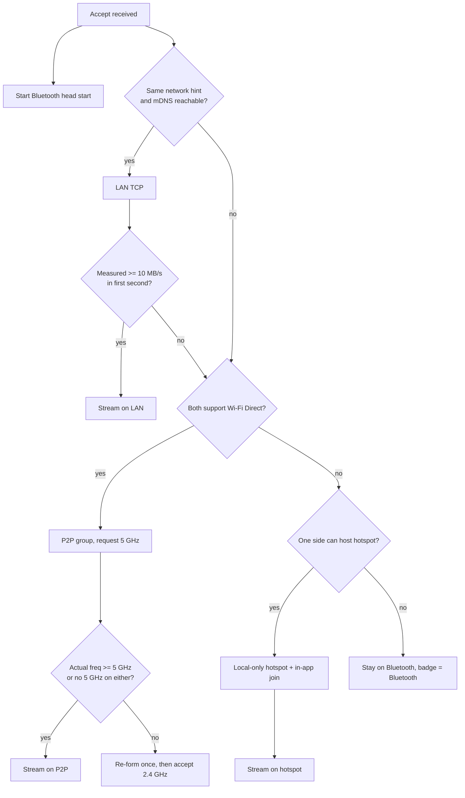
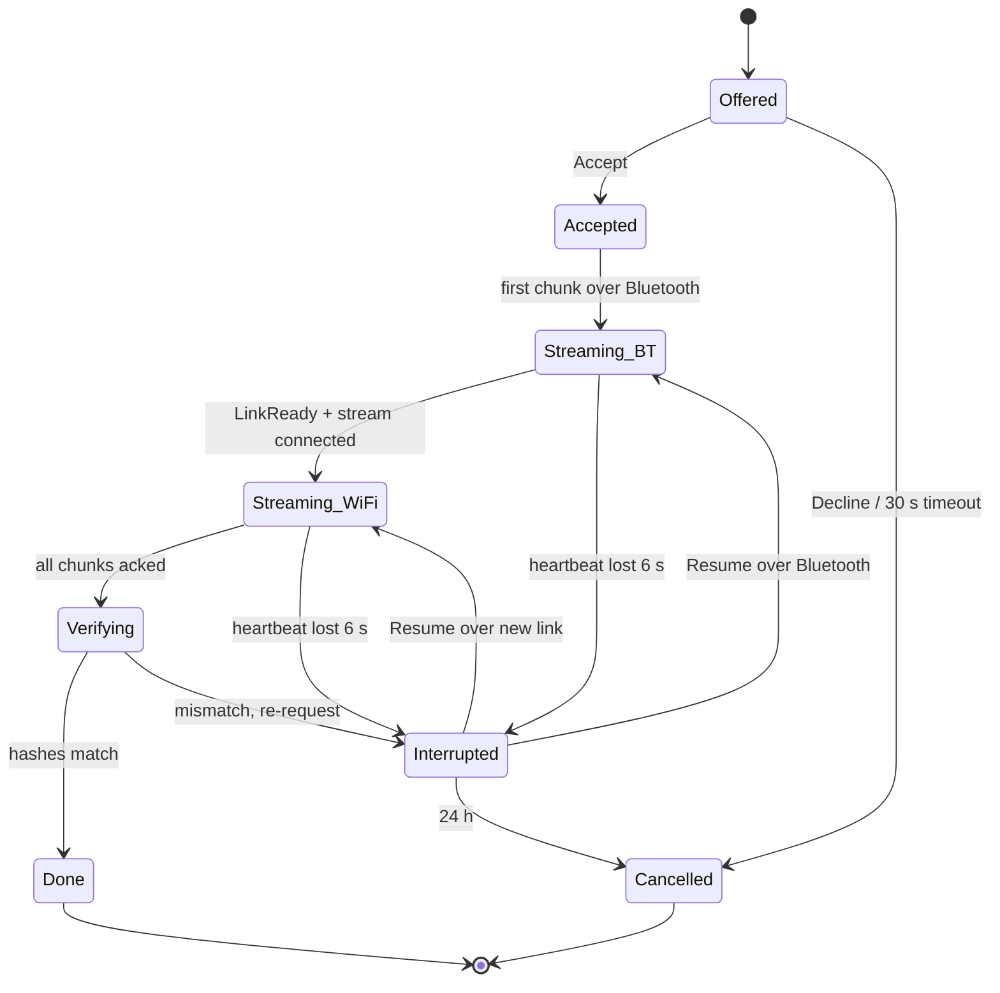

# Architecture and Technical Requirements (TRD)

**Version:** 0.1 draft · **Date:** 23 Sep 2026 · **Targets:** Android 12–17 (API 31+), Windows 10/11, macOS 12+, Ubuntu 22.04+, browser receive page

## 1. Principles

1. **Bluetooth for the first two seconds, Wi‑Fi for the payload.** BLE moves 0.1–0.2 MB/s; a direct 5 GHz Wi‑Fi link moves 20–100 MB/s.
2. **Offline-first.** No server exists in version 1. Discovery, pairing, transfer, history: all on the two devices.
3. **One core, thin shells.** Protocol, crypto, chunking, resume and the database are shared; each platform adds only radios, storage and UI.
4. **Never assume hardware.** Detect capabilities at start, publish them in the beacon, choose the best common path, verify the result (actual channel frequency).
5. **Honest feedback.** The transport badge and hints are first-class outputs of the engine, not UI decoration.

## 2. System context

```mermaid
flowchart LR
  subgraph Phone A
    UA[UI: radar, cards, dashboard] --> SA[Transfer service]
    SA --> CA[Shared core]
    CA --> RA[Radios: BLE, Wi-Fi Direct,<br/>hotspot, LAN, RFCOMM]
  end
  subgraph Device B (phone / desktop / browser)
    UB[UI] --> SB[Transfer service]
    SB --> CB[Shared core]
    CB --> RB[Radios / network]
  end
  RA <-- BLE beacon + handshake --> RB
  RA <== Wi-Fi link: 4-8 encrypted streams ==> RB
```

There is no third box. The browser receive page is served by the phone itself over its hotspot.

## 3. Module layout (Kotlin Multiplatform, assumed; see `handoff.md` for the Rust alternative)

```
repo/
├── core/
│   ├── protocol/      # framing, CBOR messages, transfer state machine
│   ├── crypto/        # identity keys, X25519/HKDF, AEAD, SAS, QR payload signing
│   ├── discovery/     # beacon encode/decode, capability flags, ephemeral ID, mDNS record model
│   ├── transfer/      # chunker, bundler, stream scheduler, ack window, resume manifest, throughput meter
│   ├── ladder/        # transport selection, link lifecycle, restore-previous-network policy
│   └── data/          # SQLDelight schema, repositories (device, transfer, transfer_file, chunk_manifest, settings)
├── platform/
│   ├── android/       # BLE advertise/scan, GATT/RFCOMM, WifiP2pManager, LocalOnlyHotspot, WifiNetworkSpecifier, NsdManager, MediaStore, ForegroundService, thermal
│   ├── desktop-win/   # WinRT BLE, Windows.Devices.WiFiDirect, WLAN join, mDNS (JmDNS), tray
│   ├── desktop-mac/   # CoreBluetooth (JNI/Swift helper), CoreWLAN join, Bonjour, menu bar
│   └── desktop-linux/ # BlueZ D-Bus, NetworkManager D-Bus, Avahi, tray
├── ui/
│   ├── shared/        # Compose: radar, bubbles, drop animation, cards, dashboard tabs (Compose Multiplatform)
│   ├── android/       # Activity, share-sheet intents, direct share, permissions flows
│   └── desktop/       # window, drag-and-drop, tray menus
├── web-receive/       # static HTML/CSS/JS page embedded in the phone app; served by Ktor
├── tools/
│   ├── bench/         # benchmark harness, CSV output, nightly two-phone rig scripts
│   └── fuzz/          # protocol fuzzers
└── docs/              # this pack
```

Dependency direction: `ui → platform → core`. `core` has no Android or JVM-desktop imports; platform modules implement `core` interfaces (`BeaconRadio`, `DataChannel`, `WifiLinkProvider`, `LanDiscovery`, `FileStore`, `PowerPolicy`).

## 4. Transport ladder

Input: capability flags of both devices (from beacons), the network hint of both, radio states. Output: an ordered list of `LinkCandidate`s. The engine starts the Bluetooth head start immediately and brings up the first candidate in parallel.



Rules:

- Two phones on mobile data have different (or no) network hints → the LAN branch is skipped in < 1 ms.
- Group owner election: prefer the device that (a) can host 5 GHz, (b) has Wi‑Fi 6+, (c) has more battery; tie → the receiver.
- Any candidate that fails within its timeout (LAN 1 s, P2P 6 s, hotspot 6 s) falls through to the next while the Bluetooth stream keeps the transfer alive.
- The link is torn down and the previous network restored within 5 s of `Complete`/`Cancel`, or after 60 s idle with no queued transfers.

## 5. Discovery

### 5.1 BLE beacon (legacy advertising, 31 bytes total)

| Offset | Size | Field | Notes |
| --- | --- | --- | --- |
| 0 | 3 | Flags AD structure | Standard LE General Discoverable |
| 3 | 4 | 16-bit Service UUID AD structure | App service UUID (assign from a 16-bit range only if registered; otherwise use 128-bit in scan response and service data with a 16-bit alias — verify size budget) |
| 7 | 2 | Service Data AD header | Length + type 0x16 |
| 9 | 2 | Service UUID (16-bit) | Same UUID |
| 11 | 1 | Protocol version | 0x01 |
| 12 | 6 | Ephemeral device ID | See §5.3 |
| 18 | 2 | Capability flags | See §5.2 |
| 20 | 4 | Network hint | Truncated SHA‑256 of current BSSID (or zeros) |
| 24 | 1 | Visibility + platform | 2 bits visibility, 3 bits platform (phone, laptop, desktop, browser-proxy), 3 bits reserved |
| 25 | 6 | Reserved / padding | Keep total ≤ 31 |

Scan response (another 31 bytes): Complete Local Name (nickname, UTF‑8, truncated to 12 bytes) + 128-bit service UUID.
Where Extended Advertising is supported on both sides, the same fields are sent in one extended PDU with the full nickname; legacy stays on for compatibility.

Timing: advertise interval 100 ms foreground / 1000 ms background (`ADVERTISE_MODE_LOW_LATENCY` / `LOW_POWER`); scan `SCAN_MODE_LOW_LATENCY` while the radar is visible, `SCAN_MODE_LOW_POWER` in background with a service-UUID filter.

### 5.2 Capability flags (16 bits)

| Bit | Meaning |
| --- | --- |
| 0 | Wi‑Fi 5 GHz supported |
| 1 | Wi‑Fi 6 GHz supported |
| 2 | Wi‑Fi 6 (802.11ax) or newer |
| 3 | Wi‑Fi Direct supported |
| 4 | Can host a 5 GHz P2P group (verified at least once) |
| 5 | Can host a local-only hotspot |
| 6 | Wi‑Fi Aware supported |
| 7 | Bluetooth Classic RFCOMM available |
| 8 | BLE extended advertising supported |
| 9 | BLE LE Coded PHY supported |
| 10 | Default save location is removable (microSD) |
| 11 | Currently connected to a Wi‑Fi network (network hint valid) |
| 12 | Desktop without Bluetooth (mDNS-only record) |
| 13–15 | Reserved |

### 5.3 Ephemeral device ID and trusted resolution

- `identity_pk` = Ed25519 public key (32 bytes). `device_id` = SHA‑256(identity_pk)[0..16].
- Every 15 minutes: `epoch = floor(unix_time / 900)`; `eph_id = HMAC‑SHA256(k_adv, epoch)[0..6]`, where `k_adv` is a per-device secret rotated when the user taps "Reset identity".
- For a trusted peer, both sides hold `recognition_secret` (derived at pairing via HKDF from the session key with label `"recog"`). The peer's beacon is resolved by computing `HMAC(recognition_secret, epoch)[0..6]` for the current and adjacent epochs and comparing. Untrusted observers see an unlinkable 6-byte value.
- Trusted-only visibility: the device advertises but the `eph_id` uses the recognition scheme only; strangers cannot start a handshake because the GATT/RFCOMM channel requires a proof of `recognition_secret` in the Hello.

### 5.4 mDNS / DNS‑SD record

Service type `_<appname>._tcp` (decide with the name). TXT keys: `v=1`, `id=<device_id hex>`, `eph=<eph_id hex>`, `cap=<flags hex>`, `plat=<phone|laptop|desktop>`, `nick=<nickname>`, `port=<control port>`. Announced on Android with `NsdManager`, on desktop with JmDNS / Bonjour / Avahi. Used for the LAN path and for computers without Bluetooth.

## 6. Handshake

> **Changed (WP2):** implemented in `core/crypto` (packages `handshake`, `qr`, `trust`) with spec changes N1, N2, N3 and S3 of `docs/implementation-plan.md`. Where §6.2 and §6.3 below differ, this note wins.
>
> - **Three plaintext messages, commit then reveal (N1).** All are deterministic CBOR maps with integer keys (RFC 8949 §4.2.1; decoders accept only the canonical encoding, at most 1024 bytes). `Hello` A→B: `1` version, `2` identity_pk_A, `3` commitment = SHA‑256("drop-commit-v1" ‖ eph_pk_A ‖ nonce_A), `4` caps (16 bits), `5` nickname (≤ 64 UTF‑8 bytes), `6` platform (3 bits), `7` AEAD preference (`1` AES‑256‑GCM, `2` ChaCha20‑Poly1305), `8` trusted proof (optional). `HelloAck` B→A: `1` version, `2` identity_pk_B, `3` eph_pk_B, `4` nonce_B, `5` caps, `6` nickname, `7` platform, `8` AEAD preference, `9` trust ack (optional), `10` sig_B. `HelloReveal` A→B: `1` eph_pk_A, `2` nonce_A, `3` sig_A. Nonces are 16 bytes. `Hello` no longer carries `eph_pk` or a signature.
> - **Transcript signatures (N2).** `th(m₁…mₖ) = SHA‑256("drop-transcript-v1" ‖ Σ u32be(len mᵢ) ‖ mᵢ)` over the exact bytes sent. sig_B = Ed25519("drop-sig-ack-v1" ‖ th(Hello, HelloAck without key 10)); sig_A = Ed25519("drop-sig-reveal-v1" ‖ th(Hello, HelloAck, HelloReveal without key 3)). B checks the commitment, then sig_A; A checks sig_B. Version, caps, nickname and platform are used only after verification. Refused: bad signature, commitment mismatch, all-zero X25519 output, wrong field size or range, version other than 1, an identity key of small order (the 8 torsion points in any encoding, under which anyone can sign; also refused in QR codes and by `ed25519Verify`), the peer using our own identity key, and (reconnects, N3) an identity other than the one the caller expects.
> - **Key schedule.** `ss = X25519(eph)`; `k_session = HKDF‑SHA256(ikm = ss, salt = nonce_A ‖ nonce_B, info = "drop-session-v1" ‖ th(Hello, HelloAck, HelloReveal))`; then `HKDF‑SHA256(ikm = k_session, salt = "", info = label)` for `k_A→B` ("drop-key-a2b-v1"), `k_B→A` ("drop-key-b2a-v1"), the Finished keys ("drop-finished-a-v1", "drop-finished-b-v1") and `recognition_secret` ("drop-recog-v1"). Key confirmation: each side's first encrypted control payload (stream 0, counter 0) is `Finished = HMAC‑SHA256(own finished key, th)`, checked before anything else from the peer is acted on.
> - **SAS (F‑B3).** `u32be(SHA‑256("drop-sas-v1" ‖ identity_pk_A ‖ identity_pk_B ‖ eph_pk_A ‖ eph_pk_B ‖ nonce_A ‖ nonce_B)[0..4]) mod 10⁶`, six digits, zero-padded. A fixes eph_pk_A before it sees eph_pk_B and B fixes eph_pk_B before it sees eph_pk_A, so a man in the middle cannot search within one handshake: security is 10⁻⁶ **per started handshake**. It can still start many. As initiator towards B it knows every SAS input once the `HelloAck` arrives, before it reveals anything, and can drop the connection unseen whenever B's code differs from the one the other victim shows. So attempts must be capped:
>   - **Responder.** One `HandshakeGuard` per device, shared by every responder on every transport, holds a `PairingAttemptLimiter` for handshakes without a valid trusted proof: one in flight at a time (30 s time-out); each one that ends without a verified `HelloReveal` (bad reveal, dropped connection, `abort()`, time-out) or that the UI reports as a rejected code is a failure; after 5 free failures new untrusted handshakes are refused with `RATE_LIMITED` for 1 min, doubling per further failure up to 1 h; one failure is forgiven per quiet hour. An attacker gets 11 guesses in the first hour and about one per hour after that: about 1 % success after a year of continuous probing. Trusted peers bypass the limiter. The protocol layer calls `abort()` when a connection closes mid-handshake.
>   - **Initiator.** The UI shows the SAS as soon as the handshake result exists, on both sides, not only after Finished, and an untrusted handshake is never retried automatically: each retry is a fresh guess the user would not see.
> - **AEAD choice.** AES‑256‑GCM when both preferences say AES, otherwise ChaCha20‑Poly1305 (§7.1). The preferences are signed, so neither can be downgraded.
> - **Trusted proof (S3, §5.3).** With a stored pairing A adds `proof = HMAC‑SHA256(recognition_secret, "drop-proof-v1" ‖ u64be(epoch) ‖ identity_pk_A ‖ commitment)`, where `epoch = floor(unix_time / 900)` on A's clock (not sent). B accepts a proof for its own epoch ± 1, and remembers every `(identity_pk_A, commitment)` it accepted for 45 min (the longest a proof stays acceptable, in the device's `HandshakeGuard`); a repeat counts as no proof. So a sniffed `Hello` cannot be replayed to get past Trusted-only mode, or to collect B's signed `HelloAck` and identity, which would link B across beacon rotations (F‑J1). In Trusted-only mode B refuses a `Hello` without a valid, fresh proof with `TRUST_PROOF_REQUIRED` before sending anything. When B accepts a proof it adds `trust ack = HMAC‑SHA256(recognition_secret, "drop-proof-ack-v1" ‖ u64be(epoch) ‖ identity_pk_B ‖ commitment)` with the epoch the proof verified under, so A learns that B still holds the pairing. The recognition secret is only used for this proof; beacons resolve through the shared `k_adv` (§13 note).
> - **Reconnects (N3).** Every reconnect runs this handshake again (fresh keys, counters from 0) and passes the peer's identity key as the expected identity.
> - **QR payload (§6.3).** Keys `1` v, `2` id, `3` identity_pk, `4` eph_id (6 bytes), `5` link {`1` kind "p2p"|"hotspot"|"lan", `2` ssid, `3` pass, `4` addr, `5` port} (optional), `6` exp (optional), `7` sig. `sig = Ed25519("drop-qr-v1" ‖ encoding of keys 1–6)`; the context prefix is new. A code with `link` must carry `exp`. The scanner refuses a code whose signature fails, whose id ≠ device_id(identity_pk), whose `exp` has passed (T‑12), or whose `exp` lies more than 5 min + 2 min clock allowance ahead. The QR text is base64url without padding.

### 6.1 Channel

Android↔Android and Android↔desktop with Bluetooth: **RFCOMM** (`listenUsingInsecureRfcommWithServiceRecord` / `createInsecureRfcommSocketToServiceRecord` with the app UUID) — "insecure" avoids the system pairing dialog; our own crypto secures it. A **GATT** characteristic channel (MTU‑negotiated, ≤ 512 bytes per write) is kept as the alternative for iPhone later and for desktops whose BLE stack cannot do RFCOMM (macOS). On the LAN path the handshake runs over the TCP control connection instead.

### 6.2 Messages

| Message | Fields |
| --- | --- |
| `Hello` | `version`, `identity_pk` (Ed25519), `eph_pk` (X25519), `nonce` (16 B), `caps`, `nickname`, `platform`, `sig` = Ed25519 over (`eph_pk` ‖ `nonce` ‖ peer nonce if known), optional `recognition_proof` |
| `HelloAck` | Same fields from the responder |

Session key: `ss = X25519(eph_sk, peer_eph_pk)`; `k_session = HKDF‑SHA256(ss, salt = nonce_A ‖ nonce_B, info = "session-v1")`. Directional keys `k_A→B`, `k_B→A` derived with labels.

Short authentication string (first pairing only): `SAS = decimal(SHA‑256("sas-v1" ‖ identity_pk_A ‖ identity_pk_B ‖ eph_pk_A ‖ eph_pk_B)[0..4] mod 10^6)`, zero-padded to 6 digits, shown on both screens. The user confirms once; both sides then store the peer as trusted with `recognition_secret = HKDF(k_session, "recog")`.

### 6.3 QR payload

CBOR, base64url in the QR: `{v:1, id, identity_pk, eph_id, link:{kind:"p2p"|"hotspot"|"lan", ssid, pass, addr, port}, exp:<unix>, sig}` where `sig` is Ed25519 over all preceding fields. Expiry 5 minutes for one-time codes; `link` omitted and `exp` absent for static device QRs (desktop). Scanning verifies `sig`, treats the pairing as verified (no SAS), and connects directly to `link` if present.

## 7. Transfer protocol

### 7.1 Framing

> **Changed (WP3):** `length` counts the payload bytes only, not the length field or the type byte, so a frame is `5 + length` bytes. Types: `0x01` Hello, `0x02` HelloAck, `0x03` HelloReveal (plaintext, N1), `0x04` Finished (N2), `0x10` Control, `0x11` Chunk, `0x12` StreamOpen (protected). Decoders reject an unknown type, or a length above the type's limit (4 KiB for handshake frames and StreamOpen, 65 KiB for Control, 4 MiB + 64 KiB for Chunk), before allocating the payload. AEAD associated data = `u32 sealed_length ‖ u8 type ‖ u32 stream_id` (N2); the sealed size may grow with the plaintext (for example one tag per 64 KiB AEAD block of a chunk). Frames are sealed while the writer holds its lock, so each stream's frames reach the wire in nonce-counter order however many coroutines write. Stream ids (S7): 0 control and 1 Bluetooth data, both on the connection the handshake ran on; 2 and up for data connections, never reused in a session. The side that opens a data connection takes the id from its own partition, the handshake initiator even ids and the responder odd ids, so the peers never pick the same id even when the connecting side changes between link generations. Every new data connection starts with a StreamOpen frame: `u32 stream_id` in clear, then the sealed `StreamOpen` message, which must name the same id; before opening anything the listener rejects an id below 2, outside the peer's partition, or already opened in the session. The cipher sits behind `FrameProtector` in `core/protocol`; `core/transfer` adapts `core/crypto` to it.

All streams carry length-prefixed frames: `u32 length` ‖ `u8 type` ‖ payload. Control frames are CBOR maps; data frames are binary. Every frame after the handshake is AEAD-encrypted: AES‑256‑GCM with a 12-byte nonce = `u32 stream_id` ‖ `u64 counter`; ChaCha20‑Poly1305 when the platform reports no AES hardware.

### 7.2 Control messages

> **Changed (WP3):** A control payload is the deterministic CBOR array `[type, body]`: definite lengths, shortest-form heads, keys in canonical order, no tags; `body` maps integer labels to fields. Types: 1 Offer, 2 FileList, 3 Accept, 4 Decline, 5 Ack, 6 Resume, 7 Hint, 8 LinkReady, 9 Heartbeat, 10 FileDone, 11 Complete, 12 Cancel, 13 ControlMoved (N13), 14 TrustShare (S3), 15 StreamOpen (S7), 16 Retransmit. Forward compatibility: labels and codes are never reused; decoders ignore unknown keys and (after authentication) unknown message types, read unknown reason codes as `other`, and keep link kinds and hint codes as strings; a change old peers must not ignore bumps `Offer.version`. A message is at most 64 KiB. `Offer` is a summary (N12): count, total bytes, MIME histogram, up to six names and six previews of at most 4 KiB, `chunk_size`, `bundle_small`, `bundle_count` (S4) and `link_options`, with credentials when the sender will be group owner (S5). The file list follows `Accept` as paged `FileList`s; hashes move to `FileDone` (S2). `Accept` carries a link intent (credentials when the receiver hosts), optional resume state and `stream_count`; `LinkReady` always carries the measured `freq_mhz` and any host credentials not known earlier. `Ack` entries can name a Bluetooth block (S1). `Resume` lists missing unit ranges per `file_index` (0xFFFFFFFF = bundles) with an optional first block offset, plus ranges of wholly missing files; it is sent on every reconnect and is the complete missing set, so the sender replaces its queue with exactly those units. `Retransmit` has the same body but is additive: sent while connected after a hash mismatch, it asks for the listed units again (a bad Bluetooth block from its offset) and the sender drops nothing. Field labels: KDoc in `core/protocol/.../ControlMessages.kt`; exact bytes: `GoldenVectors.kt`.

| Type | Direction | Fields |
| --- | --- | --- |
| `Offer` | S→R | `transfer_id` (16 B), `files[]{index, name, size, mime, sha256}`, `chunk_size` (4 MiB), `bundle_small` (bool), `link_options[]`, `total_bytes` |
| `Accept` | R→S | `transfer_id`, `chosen_link{kind, ssid, pass, addr, port, band_hint}`, `resume_bitmap` (optional, per file), `stream_count` |
| `Decline` | R→S | `transfer_id`, `reason` |
| `Ack` | R→S | `transfer_id`, `chunks[]{file_index, chunk_index}` verified (batched every 50 ms or 8 chunks) |
| `Resume` | R→S | `transfer_id`, `missing[]{file_index, chunk_ranges}` |
| `Hint` | either | `code` (`band24`, `peer_band24_only`, `sdcard`, `thermal`, `bundling`, `bt_fallback`, `lan_slow`), `params` |
| `LinkReady` | either | `kind`, `addr`, `port`, `freq_mhz` (the measured channel) |
| `Heartbeat` | either | `t` (every 2 s on the control stream) |
| `Complete` | S→R then R→S | `transfer_id`, `status`, `bytes`, `duration_ms` |
| `Cancel` | either | `transfer_id`, `reason` |

### 7.3 Data frame (type `Chunk`)

> **Changed (WP3):** The header gains `u32 block_offset` after `chunk_index` (S1): 48 bytes = `transfer_id` 16 ‖ `file_index` 4 ‖ `chunk_index` 4 ‖ `block_offset` 4 ‖ `payload_len` 4 ‖ `hash` 16. A Wi-Fi frame carries a whole unit (`block_offset` 0); a Bluetooth frame may carry one 16 KiB block, and `hash` (XXH3-128, decision 6) always covers that frame's payload. For bundles `chunk_index` is the bundle number and `offset_in_bundle` counts from the start of the data area. Bundle plan (S4): files smaller than `min(1 MiB, chunk_size / 4)` are bundled greedily in file-index order, and a file that would push index plus data past `chunk_size` starts a new bundle; both sides derive the plan from the file list and check it against `Offer.bundle_count`. The whole-file SHA-256 arrives in `FileDone` (S2). Sizes are MiB (S6).

| Field | Size | Notes |
| --- | --- | --- |
| `transfer_id` | 16 B | |
| `file_index` | u32 | `0xFFFFFFFF` = bundle |
| `chunk_index` | u32 | |
| `payload_len` | u32 | ≤ 4 MiB |
| `hash` | 16 B | BLAKE3 (or XXH3‑128) of plaintext payload |
| `payload` | variable | Encrypted with the frame |

Bundle payload: `u32 count` then repeated `{u32 file_index, u32 offset_in_bundle, u32 len}` index, followed by concatenated small-file bytes. A file < 1 MiB is always bundled; a file ≥ 1 MiB is chunked. Whole-file `sha256` from the Offer is verified after the last chunk/bundle for that file lands (hardware SHA on ARMv8/x86).

### 7.4 Streams, scheduling, flow control

- Data streams: 4 by default; raise to 8 when the 1‑second measured throughput exceeds 40 MB/s; lower to 2 under thermal throttling.
- A shared chunk queue feeds all streams (work stealing). Each stream keeps 2 chunks in flight; the sender does not send a chunk until the previous‑but‑one on that stream is acked (per-stream window of 2).
- Receiver: each stream writes to a bounded write queue (16 MiB) drained by one writer thread per destination file; TCP backpressure slows the sender if storage falls behind.
- Socket options: 4 MiB send/receive buffers, `TCP_NODELAY` on control only; on Android all sockets are created from the `Network` returned by `ConnectivityManager` for the P2P/hotspot link (`network.socketFactory`) or `bindProcessToNetwork` so traffic never drifts to mobile data.
- Throughput meter: bytes acked per 250 ms, EWMA α = 0.3 for display; ETA from remaining bytes ÷ EWMA.

### 7.5 Head start and hop

After `Accept`, chunk 0 (and bundles first, since they are most visible in the UI) starts over the RFCOMM/GATT stream at whatever it can do. When `LinkReady` arrives and a data stream connects, the Bluetooth stream finishes its in-flight chunk and stops; the queue continues on Wi‑Fi. Acks are per chunk, so no double-send occurs. Badge changes from "Bluetooth" to the Wi‑Fi kind on the first Wi‑Fi ack.

### 7.6 Resume

Receiver persists `chunk_manifest{transfer_id, file_index, received_bitmap}` after each verified chunk (write-behind ≤ 100 ms). On any reconnect, R sends `Resume` with missing ranges; S re-queues only those. Partial files live under app-private storage as `<transfer_id>/<file_index>.part`; on completion they are moved (rename where possible) into MediaStore/Downloads. Partials and manifests are deleted 24 h after the transfer's last activity.

### 7.7 State machine

> **Changed (WP3):** `Interrupted` is split into `Reconnecting` (active reconnect attempts for 2 min) and `Parked` (waiting for the peer's beacon until 24 h after the interruption, then `Cancelled` with `timeout` and partials cleared); a beacon seen while parked goes back to `Reconnecting` (S8). `Streaming_WiFi` can follow `Accepted` directly (LAN path). A hash mismatch no longer interrupts: the unit is re-requested with `Retransmit` (from `Verifying`, back to streaming) and the third mismatch on a unit or file fails that file. The transfer ends `Done` (with `Complete.status = partial` if some files failed), or `Failed` when every file failed or the peer broke the protocol. A receiver that resolves its last file while `Reconnecting` or `Parked` stays there and sends `Complete` once `Resume` has been exchanged; if the parked window closes first it ends with that outcome without sending it. Implemented as the pure reducer `TransferStateMachine` in `core/protocol`.



### 7.8 Timeouts and errors

> **Changed (WP3):** The values live in `ProtocolConstants` and `TransferStateMachine` enforces them with timer effects: offer 30 s (the sender sends `Cancel`, the receiver `Decline`, both with `timeout`), heartbeat 6 s, reconnect window 2 min, parked window 24 h counted from the interruption (S8). Mismatch strikes count per unit (per-frame hash) and per file (SHA-256). A whole-file mismatch re-requests the file's units (its bundle for a bundled file); an empty file that mismatches fails at once, since nothing can be sent again. Cancel reasons: `user`, `storage`, `timeout`, `verification`, `protocol`, `source`, `other`. Decline reasons: `user`, `busy`, `timeout`, `storage`, `incompatible`, `blocked`, `other`.

| Event | Timeout | Action |
| --- | --- | --- |
| Offer unanswered | 30 s | Cancel; sender sees "No answer" |
| LAN candidate | 1 s to connect, 1 s to measure | Fall through |
| P2P group formation | 6 s | Fall through to hotspot |
| Hotspot start + join | 6 s | Fall through to Bluetooth-only |
| Heartbeat lost | 6 s | Interrupted; keep manifest; attempt reconnect for 2 min, then wait for the peer's beacon |
| Chunk hash mismatch | immediate | Discard, request again; 3 mismatches on one chunk → fail the file |
| Disk full on receiver | immediate | Cancel with `reason=storage`; clear partials |
| Thermal `SEVERE` or higher | — | Streams → 2; Hint `thermal` |

## 8. Link setup by path (platform APIs)

| Path | Android | Windows | macOS | Linux |
| --- | --- | --- | --- | --- |
| Discovery (BLE) | `BluetoothLeAdvertiser`, `BluetoothLeScanner` | `BluetoothLEAdvertisementPublisher` / `Watcher` (WinRT; publisher payload limits — verify) | `CBPeripheralManager` (service UUID + name only), `CBCentralManager` | BlueZ `LEAdvertisement1`, `org.bluez.Adapter1` |
| Handshake channel | RFCOMM insecure socket (fallback GATT) | RFCOMM via `RfcommServiceProvider` / `StreamSocket` | GATT (no RFCOMM for apps) | RFCOMM via BlueZ profile |
| LAN discovery | `NsdManager` | JmDNS | Bonjour (`NetService`) or JmDNS | Avahi or JmDNS |
| Wi‑Fi Direct | `WifiP2pManager.createGroup(config)` with `WifiP2pConfig.Builder().setNetworkName("DIRECT-xx-…").setPassphrase(…).setGroupOperatingBand(GROUP_OWNER_BAND_5GHZ).enablePersistentMode(true)`; joiner `connect(config)`; verify `WifiP2pGroup.getFrequency()` | `Windows.Devices.WiFiDirect` (connect as client to phone's group) — verify band behaviour | Not available | Not used |
| Hotspot host | `WifiManager.startLocalOnlyHotspot(callback)`; read `reservation.softApConfiguration` for SSID/password/band (band not selectable by third-party apps — verify actual frequency) | Mobile hotspot API is system-only; phone hosts | Phone hosts | Phone hosts |
| Hotspot join | `WifiNetworkSpecifier` + `ConnectivityManager.requestNetwork` → use the returned `Network` for sockets | `WiFiAdapter.ConnectAsync(ssid, password)` or `netsh wlan` | `CWInterface.associate(to:password:)` (Location permission required to scan) | NetworkManager D-Bus (`AddAndActivateConnection`) or `nmcli` |
| Restore previous Wi‑Fi | Release the `NetworkRequest`; remove P2P group; system reconnects | Reconnect saved profile | `associate` back to previous SSID | Activate previous connection |

Notes:

- Android 12 requires `ACCESS_FINE_LOCATION` for Wi‑Fi Direct discovery; Android 13+ uses `NEARBY_WIFI_DEVICES` with `neverForLocation`.
- Android 14+ requires `foregroundServiceType="dataSync"` and `FOREGROUND_SERVICE_DATA_SYNC`; Android 15 limits dataSync services to about 6 hours per day — transfers never approach this, but log it.
- The P2P network name must start with `DIRECT-` followed by two characters; passphrase 8–63 characters; generate randomly per transfer unless persistent mode is used for trusted pairs.

## 9. Speed engineering rules (where they live in code)

| Rule | Module | Implementation note |
| --- | --- | --- |
| Request 5 GHz, verify, re-form once | `core/ladder`, `platform/android` | Read actual frequency; treat 2.4 GHz with both-capable as failure once |
| One radio, one job | `core/ladder` | Leave infrastructure Wi‑Fi during P2P/hotspot; stop BLE scan/advertise after handshake; resume after `Complete` |
| Big pipes | `core/transfer` | 4 MiB chunks, direct `ByteBuffer`s, `FileChannel.transferTo` where the AEAD allows (encrypt in 64 KiB blocks to keep memory flat) |
| Pack small files | `core/transfer` | Bundler threshold 1 MiB; gallery registration batched |
| Storage awareness | `platform/*` | Detect removable target; Hint `sdcard`; write queue 16 MiB |
| Stay awake and cool | `platform/android` | Foreground service, partial wake lock, `PowerManager` thermal listener |
| Instant start | `core/ladder`, `core/transfer` | Head start over BT; pre-warm on file pick; persistent groups for trusted peers |

## 10. Platform layer details

### 10.1 Android

- **Process model:** one `TransferService` (foreground, `dataSync`) owns radios and the engine; the UI binds to it and observes `StateFlow`s. The service starts on the first Offer/Accept and stops 60 s after the last transfer.
- **Share sheet:** `ACTION_SEND`, `ACTION_SEND_MULTIPLE` for `*/*`; direct share via `ShortcutManagerCompat` dynamic shortcuts for trusted nearby devices (refreshed from the radar).
- **Storage:** read via SAF/`MediaStore` URIs (no broad storage permission); write media with `MediaStore` `IS_PENDING` then publish; documents to `Downloads` via `MediaStore.Downloads`; partials in `getFilesDir()/partials`.
- **Battery:** onboarding step opens brand-specific screens (Xiaomi Autostart, Vivo/Oppo background, Samsung sleeping apps) and `ACTION_REQUEST_IGNORE_BATTERY_OPTIMIZATIONS`.
- **Thermal:** `PowerManager.addThermalStatusListener`; `THERMAL_STATUS_SEVERE`+ → streams 2 and hint.
- **Radios off:** `BluetoothAdapter.ACTION_REQUEST_ENABLE`; `Settings.Panel.ACTION_WIFI` panel (apps cannot toggle Wi‑Fi on Android 10+).

### 10.2 Desktop (Compose Multiplatform + JVM)

- Native helpers per OS where the JVM cannot reach the API: a small Swift helper process on macOS (CoreBluetooth/CoreWLAN), WinRT projections on Windows (via JNA/JNI or a C# helper), D-Bus on Linux (dbus-java). Keep helpers stateless and message-driven so the JVM engine stays authoritative.
- Received folder default `~/Received/<App>/`; Windows marks downloads with the Mark-of-the-Web zone identifier; macOS quarantine attribute set.
- Tray via `java.awt.SystemTray` or a native shim; single instance guard; auto-start opt-in.

### 10.3 Browser receive page

- The phone runs an embedded HTTP server (Ktor CIO) bound to the hotspot/P2P interface only, port from the QR, mDNS name `drop.local` where the joining OS resolves mDNS (Windows 10+, macOS, most Linux); IP shown as fallback.
- Endpoints: `GET /` page; `GET /files` JSON; `GET /file/{index}`; `GET /all.zip` (streamed, `stored` compression, no temp file); `POST /upload` (P1).
- One-time token in the URL path from the QR; server refuses requests without it and shuts down 60 s after the last download.
- Plain HTTP over the private hotspot; the QR path token and the hotspot's WPA2 protect the session. HTTPS with a self-signed cert is not used because of browser warnings.

## 11. Android permissions

| Permission | Versions | Why | When asked |
| --- | --- | --- | --- |
| `BLUETOOTH_SCAN` (`neverForLocation`), `BLUETOOTH_CONNECT`, `BLUETOOTH_ADVERTISE` | 12+ | Find and talk to nearby devices | First radar open |
| `NEARBY_WIFI_DEVICES` (`neverForLocation`) | 13+ | Wi‑Fi Direct, hotspot, NSD without location | First radar open |
| `ACCESS_FINE_LOCATION` | 12 only | Wi‑Fi Direct discovery on Android 12 | First send on Android 12 |
| `POST_NOTIFICATIONS` | 13+ | Progress, incoming cards | First transfer |
| `READ_MEDIA_IMAGES/VIDEO/AUDIO` (12: `READ_EXTERNAL_STORAGE`) | 12+ | Picker and thumbnails | First send |
| `CAMERA` | all | Scan QR | First scan |
| `FOREGROUND_SERVICE`, `FOREGROUND_SERVICE_DATA_SYNC` (14+), `WAKE_LOCK`, `INTERNET`, `ACCESS_NETWORK_STATE`, `CHANGE_NETWORK_STATE`, `ACCESS_WIFI_STATE`, `CHANGE_WIFI_STATE` | all | Service, sockets, Wi‑Fi Direct | Declared, no prompt |
| `REQUEST_IGNORE_BATTERY_OPTIMIZATIONS` | all | Survive OEM background killing | Onboarding, once, skippable |

`INTERNET` is required for sockets even though no internet is used; the privacy screen explains this.

## 12. Data model (SQLDelight)

```sql
CREATE TABLE device (
  id TEXT PRIMARY KEY,               -- hex(sha256(identity_pk)[0..16])
  identity_pk BLOB NOT NULL,
  nickname TEXT NOT NULL,
  platform TEXT NOT NULL,            -- phone|laptop|desktop|browser
  trusted INTEGER NOT NULL DEFAULT 0,
  auto_accept INTEGER NOT NULL DEFAULT 0,
  recognition_secret BLOB,           -- null when untrusted
  first_seen INTEGER NOT NULL,
  last_seen INTEGER NOT NULL
);

CREATE TABLE transfer (
  id TEXT PRIMARY KEY,
  peer_device_id TEXT NOT NULL REFERENCES device(id),
  direction TEXT NOT NULL,           -- send|receive
  transport TEXT,                    -- lan|p2p|hotspot|bluetooth
  band TEXT,                         -- 2.4|5|6
  started_at INTEGER NOT NULL,
  finished_at INTEGER,
  bytes_total INTEGER NOT NULL,
  bytes_done INTEGER NOT NULL DEFAULT 0,
  avg_speed_bps INTEGER,
  status TEXT NOT NULL,              -- offered|accepted|streaming|interrupted|verifying|done|failed|cancelled
  hint_codes TEXT                    -- comma-separated
);

CREATE TABLE transfer_file (
  transfer_id TEXT NOT NULL REFERENCES transfer(id),
  file_index INTEGER NOT NULL,
  name TEXT NOT NULL,
  mime_type TEXT,
  size INTEGER NOT NULL,
  sha256 BLOB NOT NULL,
  saved_uri TEXT,
  status TEXT NOT NULL,
  PRIMARY KEY (transfer_id, file_index)
);

CREATE TABLE chunk_manifest (
  transfer_id TEXT NOT NULL,
  file_index INTEGER NOT NULL,
  received_bitmap BLOB NOT NULL,
  updated_at INTEGER NOT NULL,
  PRIMARY KEY (transfer_id, file_index)
);

CREATE TABLE settings (key TEXT PRIMARY KEY, value TEXT NOT NULL);
```

Encryption at rest: SQLCipher on Android with a key in the Keystore; on desktop a SQLCipher JDBC build with the key in the OS keychain (verify availability per OS; fall back to file-level encryption if needed).

## 13. Security model

> **Changed (WP2):** spec changes N2, N3, N11, S3 and S7, as built in `core/crypto`.
>
> - **Identity key (N11).** No supported keystore holds Ed25519 on every platform, so the identity is a software Ed25519 seed, stored together with its public key in one entry of a `SecretStorage` that the platform encrypts at rest with a non-exportable Keystore / keychain AES key. `k_adv`, recognition secrets and the database key are protected the same way. A stored seed that does not match its public key is reported, never silently replaced.
> - **Advertising secret (S3).** `k_adv` (32 random bytes) is sent to each trusted peer inside an encrypted session (message defined in `core/protocol`), so every trusted peer resolves the same rotating beacon ID. It is rotated on "Reset identity" and on "Forget", then re-shared with the remaining trusted peers at their next session.
> - **Handshake integrity.** Commit-then-reveal, transcript signatures and Finished MACs (§6 note). The SAS protects the first pairing, at 10⁻⁶ per started handshake, with incomplete untrusted handshakes capped per device (§6 note); a verified QR code authenticates the device that shows it (one-way). Small-order Ed25519 identity keys are refused everywhere.
> - **Frames (S7, N2, N3).** Nonce = `u32 stream_id ‖ u64 counter` under the directional key; associated data = the frame header `length ‖ type ‖ stream_id`. The receiver accepts only the next counter, so replayed, reordered or dropped frames fail, and a stream that fails stays failed. The directional keys never leave `HandshakeResult`: `frameSender` hands out one sealer per stream id, so nonces cannot repeat, and a stream id is taken on the receive side only when an opener's first frame authenticates, so a forged first frame on a new connection does not use it up; once taken, a new connection for it (a replay) fails. A new link generation needs a new handshake. Per stream: at most 2³² frames and 2³⁸ payload bytes (256 GiB), after which sealing stops until the next handshake. The data path can seal and open in place into caller-supplied arrays.

| Asset | Protection |
| --- | --- |
| Identity key | Android Keystore / OS keychain; never exported |
| Beacon linkability | 15-min rotating HMAC IDs; recognition secrets only for trusted peers |
| Handshake integrity | Ed25519-signed ephemeral keys; SAS on first pairing; QR signature as out-of-band verification |
| Data in flight | AEAD per frame on top of WPA2 (P2P/hotspot) or plain LAN; passphrases only inside encrypted Accept |
| Unwanted content | Visibility defaults; Accept card; no auto-open; APK/executable warnings |
| Filesystem | Sanitised names; confinement to receive folder; size enforced against Offer |
| Data at rest | Encrypted DB; partials in app-private storage |
| Network egress | Zero outbound internet connections in a nearby session (verified in tests by packet capture) |

## 14. Observability (local only)

- Ring-buffer log (last 2,000 events) with transfer id, state transitions, link kind, measured frequency, throughput samples, hints; exportable from Settings → About as a text file for support.
- Benchmark hook: `tools/bench` starts a scripted transfer and writes `device_a, device_b, distance, file_mix, transport, band, MB_s, seconds` to CSV.
- No remote telemetry by default; opt-in crash reporting only.

## 15. Performance budgets

| Item | Budget |
| --- | --- |
| Radar first frame | ≤ 300 ms after launch |
| Beacon decode + bubble update | ≤ 5 ms per packet on the main thread (decode off-thread) |
| Handshake | ≤ 400 ms over RFCOMM |
| Memory during a 2 GB transfer | ≤ 120 MB additional |
| UI frame time during 60 MB/s transfer | ≤ 16 ms (60 fps) on the midrange lab phone |
| Battery | ≤ 4% per 1 GB sent on a 5,000 mAh phone |
| APK size | ≤ 25 MB |

## 16. Suggested dependencies

| Need | Library (verify licences) |
| --- | --- |
| Serialization | kotlinx-serialization-cbor |
| Crypto | libsodium via lazysodium (X25519, Ed25519, ChaCha20‑Poly1305); platform JCA for AES‑GCM |
| Hashing | BLAKE3 JVM binding or XXH3 (`zero-allocation-hashing`); SHA‑256 via JCA |
| Database | SQLDelight; SQLCipher |
| Networking | Ktor (embedded HTTP server), java.nio channels for data streams |
| mDNS (desktop) | JmDNS |
| Desktop native | JNA; small Swift helper on macOS; dbus-java on Linux |
| UI | Jetpack Compose, Compose Multiplatform, Lottie (optional) |
| QR | ZXing (generate/scan), CameraX (Android scan) |

## 17. Extension points

- **iPhone (Phase 2):** `BeaconRadio` over CoreBluetooth with GATT handshake; `WifiLinkProvider` via `NEHotspotConfiguration` (join) and Multipeer for iPhone↔iPhone; same protocol.
- **Internet mode (Phase 3):** a `RemoteLinkProvider` (signalling + ICE + relay) implementing the same `DataChannel` interface; the transfer engine is unchanged.
- **Courier mode (later):** a queued `Offer` that any trusted device can carry; requires per-file encryption to the final recipient's identity key.
